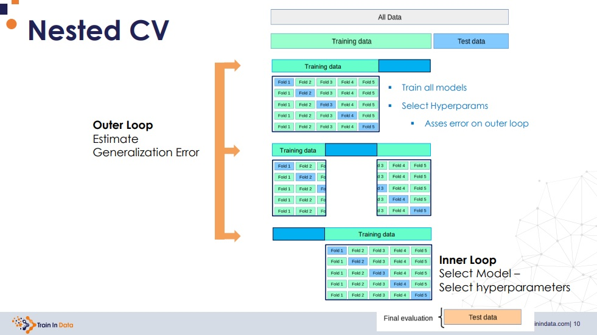
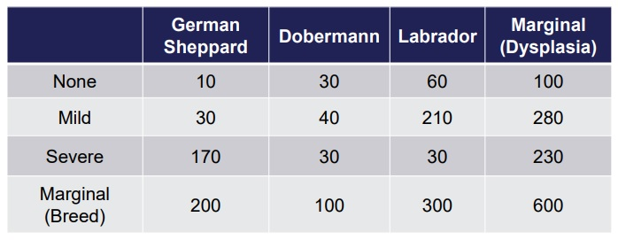
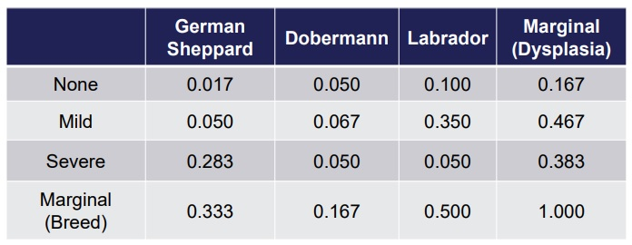
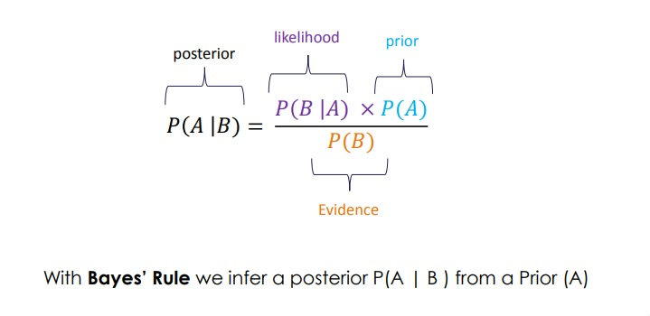
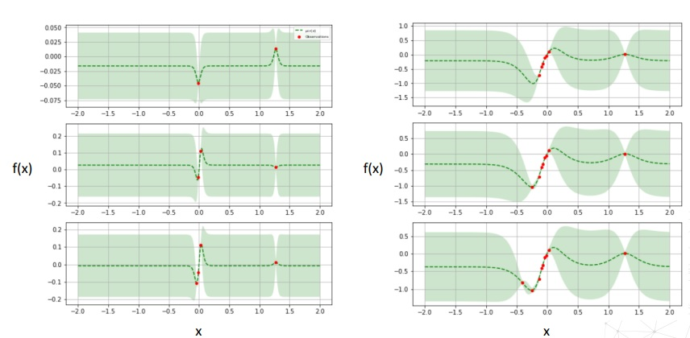
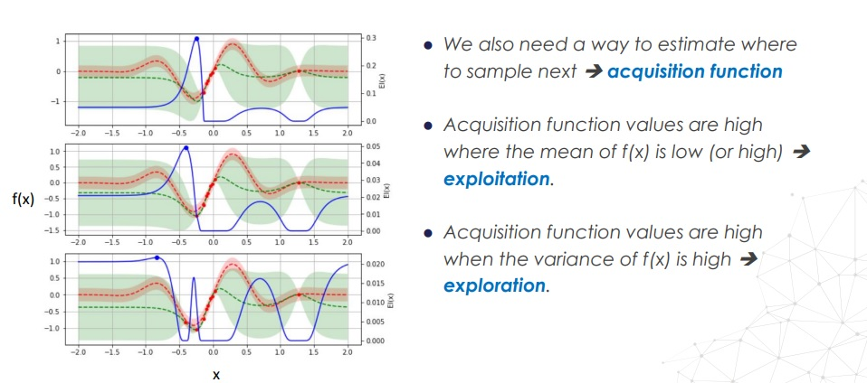
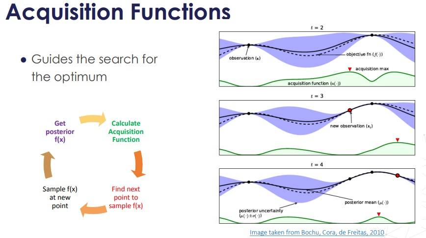

# Hyperparameter tuning for Machine Learning


[](https://github.com/solegalli/hyperparameter-optimization/blob/master/LICENSE)
[](https://www.trainindata.com/), modified by [Mikel Sagardia](https://mikelsagardia.io/)

Originally published by [Soledad Galli @ Train in Data](https://www.trainindata.com/) in May, 2021.

[](https://www.courses.trainindata.com/p/hyperparameter-optimization-for-machine-learning)

Modified by [Mikel Sagardia](https://mikelsagardia.io/) while folowing the associated Udemy course [Hyperparameter Optimization for Machine Learning](https://www.udemy.com/course/hyperparameter-optimization-for-machine-learning).

## Overview of Topics

1. **Cross-Validation**
	1. K-fold, LOOCV, LPOCV, Stratified CV
	2. Group CV and variants
	3. CV for time series
	4. Nested CV

2. **Basic Search Algorithms**
	1. Manual Search, Grid Search and Random Search

3. **Bayesian Optimization**
	1. with Gaussian Processes
	2. with Random Forests (SMAC) and GBMs
	3. with Parzen windows (Tree-structured Parzen Estimators or TPE)

4. **Multi-fidelity Optimization**
	1. Successive Halving
	2. Hyperband
	3. BOHB

5. **Other Search Algorthms**
	1. Simulated Annealing
	2. Population Based Optimization

6. **Gentetic Algorithms**
	1. CMA-ES	

7. **Python tools**
	1. Scikit-learn
	2. Scikit-optimize
	3. Hyperopt
	4. Optuna
	5. Keras Tuner
	6. SMAC
	7. Others
	8. **Added by me: Ax**

## Table of Contents

- [Hyperparameter tuning for Machine Learning](#hyperparameter-tuning-for-machine-learning)
	- [Overview of Topics](#overview-of-topics)
	- [Table of Contents](#table-of-contents)
	- [Setup](#setup)
		- [Datasets](#datasets)
	- [Section 2: Hyperparameter Tuning: Overview](#section-2-hyperparameter-tuning-overview)
		- [Examples and Code](#examples-and-code)
	- [Section 3: Performance Metrics](#section-3-performance-metrics)
		- [Examples and Code](#examples-and-code-1)
	- [Section 4: Cross-Validation](#section-4-cross-validation)
		- [Cross-Validation Schemes](#cross-validation-schemes)
		- [Hyperparameter Tuning with Different Cross-Validation Schemes](#hyperparameter-tuning-with-different-cross-validation-schemes)
		- [Special Cross-Validation Schemes: Non-Independent Data](#special-cross-validation-schemes-non-independent-data)
		- [Nested Cross-Validation](#nested-cross-validation)
	- [Section 5: Basic Search Algorithms: Grid and Random](#section-5-basic-search-algorithms-grid-and-random)
		- [Manual Search](#manual-search)
		- [Grid Search](#grid-search)
		- [Random Search](#random-search)
		- [Random Search with Other Packages](#random-search-with-other-packages)
			- [Random Search with Scikit-Optimize](#random-search-with-scikit-optimize)
			- [Random Search with Hyperopt](#random-search-with-hyperopt)
	- [Section 6: Bayesian Optimization with Scikit-Optimize](#section-6-bayesian-optimization-with-scikit-optimize)
		- [Bayesian Inference](#bayesian-inference)
		- [Bayes Rule](#bayes-rule)
		- [Sequential Model-Based Optimization (SMBO)](#sequential-model-based-optimization-smbo)
		- [Literature](#literature)
		- [Scikit-Optimize for Bayesian Optimization: Notes](#scikit-optimize-for-bayesian-optimization-notes)
		- [Example: Manual Gaussian Optimization of a Black Box 1D Function](#example-manual-gaussian-optimization-of-a-black-box-1d-function)
		- [Example: Manual Gaussian Optimiation of a Grandient Boosted Tree with 1 Hyperparameter](#example-manual-gaussian-optimiation-of-a-grandient-boosted-tree-with-1-hyperparameter)
		- [Example: Manual Gaussian Optimization of a Grandient Boosted Tree with 4 Hyperparameters](#example-manual-gaussian-optimization-of-a-grandient-boosted-tree-with-4-hyperparameters)
		- [Example: Automatic Gaussian Optimization of a Grandient Boosted Tree with 4 Hyperparameters (BayesSearchCV)](#example-automatic-gaussian-optimization-of-a-grandient-boosted-tree-with-4-hyperparameters-bayessearchcv)
		- [Example: Bayes Optimization with Different Kernels (Manual)](#example-bayes-optimization-with-different-kernels-manual)
		- [Example: Manual Bayesian Optimization of an XGBoost Classifier](#example-manual-bayesian-optimization-of-an-xgboost-classifier)
		- [Example: Manual Bayesian Optimization of a Keras-CNN](#example-manual-bayesian-optimization-of-a-keras-cnn)
	- [Section 7: Other Sequential Model-Based Optimization (SMBO) Methods](#section-7-other-sequential-model-based-optimization-smbo-methods)
		- [SMACs: Sequential Model-Based Algorithm Configuration: Using Tree-Based Models as Surrogates](#smacs-sequential-model-based-algorithm-configuration-using-tree-based-models-as-surrogates)
		- [TPE: Tree-Structured Parzen Estimators](#tpe-tree-structured-parzen-estimators)
	- [Section 8](#section-8)
	- [Section 9](#section-9)
	- [Section 10](#section-10)
	- [Section 11](#section-11)
	- [Section 12](#section-12)
	- [Section 13: Ax Platform](#section-13-ax-platform)

## Setup

Links:

- [Online Course](https://www.courses.trainindata.com/p/hyperparameter-optimization-for-machine-learning)
- [Github repository](https://github.com/trainindata/hyperparameter-optimization)
- [Slides](https://www.dropbox.com/sh/wzbn528sxwdc22k/AAD7IJej-9NwcD5bHK8bbMDka?dl=0)
- [Datasets: MNIST Kaggle](https://www.kaggle.com/c/digit-recognizer/data): rename the `train.csv` file to be `mnist.csv`.

Environment:

```bash
conda create --name hyp pip python=3.8
conda activate hyp
python -m pip install -r requirements.txt
```

### Datasets

Used datasets:

- [MNIST Kaggle](https://www.kaggle.com/c/digit-recognizer/data): CNN for classification.
- [Breast Cancer Wisconsin (Diagnostic)](https://archive.ics.uci.edu/ml/datasets/Breast+Cancer+Wisconsin+%28Diagnostic%29): linear and non-linear models (trees) for classification.
- Boston housing dataset: regression.

```python
from sklearn.datasets import load_breast_cancer
from sklearn.datasets import load_boston

breast_cancer_X, breast_cancer_y = load_breast_cancer(return_X_y=True)
X = pd.DataFrame(breast_cancer_X)
y = pd.Series(breast_cancer_y).map({0:1, 1:0})

boston_X, boston_y = load_boston(return_X_y=True)
X = pd.DataFrame(boston_X)
y = pd.Series(boston_y)
```

## Section 2: Hyperparameter Tuning: Overview

Hyperparameters are those parameters which are not learnt during taining, but chosen by the user. They can be used to:

- Improve convergence
- Improve performance
- Prevent overfitting
- etc.

However, the hyperparameters affect the parameters learnt by the model.

Typical hyperparameters for Random Forests and Gradient Boosted Trees:

- Number of trees
- The depth of the tree
- Learning rate (GBMs)
- The metric of split quality
- The number of features to evaluate at each node
- The minimum number of samples to split the data further

The most important hyperparameters are those that optimize the generalization error, which is not necessarily the loss.

Some hyperparameters do not affect the model performance; we need to try all possible value combinations, but that comes with an inrceased computational cost.

A hyperparameter search consists of:

- Hyperparameter space: the hyperparameters we are going to test and their possible values.
- A method for sampling candidate hyperparameters
  - Manual Search
  - Grid Search
  - Random Search
  - Bayesian Optimization
  - Other
- A cross-validation scheme
- A performance metric to minimize (or maximize)

Two important concepts that come up often when talking about hyperparameters optimization:

- **Hyperparameter response surface**: that's the value of the decision metric as function of the hyperparameter values; we want to minimize it. Notation: `lambda = argmin(Phi(lambda))`, i.e., `lambda` are the hyperparameter values and `Phi(lambda)` is the response surface, i.e., the decision metric.
- **Low effective dimension**: the repsonse surface is very sensitive to some hyperparameters and it doesn't change with others; we want to find which hyperparameters affect `Phi`.

### Examples and Code

We can evaluate these two concepts, e.g., when we use the `GridSearchCV` from Scikit-Learn. These notebooks show how to do that:

- [`02-01-Response-Surface.ipynb`](./Section-02-Hyperparamter-Overview/02-01-Response-Surface.ipynb)
- [`02-02-Low-Effective-Dimension.ipynb`](./Section-02-Hyperparamter-Overview/02-02-Low-Effective-Dimension.ipynb)

```python
import pandas as pd
import matplotlib.pyplot as plt

from sklearn.ensemble import RandomForestRegressor
from sklearn.model_selection import train_test_split, GridSearchCV

# model
rf_model = RandomForestRegressor(
    n_estimators=100, max_depth=1, random_state=0, n_jobs=4)

# hyperparameter space
rf_param_grid = dict(
    n_estimators=[50, 100, 200]
    max_depth=[2, 3, 4],
)

# search
# the available metrics can be passed as a string
# https://scikit-learn.org/stable/modules/model_evaluation.html#the-scoring-parameter-defining-model-evaluation-rules
reg = GridSearchCV(rf_model,
				   rf_param_grid,
                   scoring='neg_mean_squared_error',
				   cv=3)
search = reg.fit(X, y)

# best hyperparameters
search.best_params_

# We have all the CV results for each parameter combination
# in this attribute!
search.cv_results_
# mean_fit_time
# std_fit_time
# mean_score_time
# std_score_time
# params
# param_max_depth
# param_n_estimators
# split0_test_score
# split1_test_score
# split2_test_score
# mean_test_score
# std_test_score
# rank_test_score

# Get the CV results
results = pd.DataFrame(search.cv_results_)[['params', 'mean_test_score']]

## 1. Plot response surface
fig = plt.figure(figsize=(8, 8))
ax = plt.axes(projection='3d')

# depth
x = [r['max_depth'] for r in results['params']]
# number of trees
y = [r['n_estimators'] for r in results['params']]
# performance
z = results['mean_test_score']

# plotting
ax.scatter(x, y, z,)
ax.set_title('Response Surface')
ax.set_xlabel('Tree depth')
ax.set_ylabel('Number of trees')
ax.set_zlabel('negative rmse')
plt.show()

## 2. Plot effect
results = pd.DataFrame(search.cv_results_)[['params', 'mean_test_score', 'std_test_score']]
results.index = rf_param_grid['n_estimators']

results['mean_test_score'].plot(yerr=[results['std_test_score'], results['std_test_score']], subplots=True)

plt.ylim(0.2, 0.6)
plt.ylabel('Mean r2 score')
plt.xlabel('Number of trees')

# We can also plot the peformance in the hyperparameter space
results.sort_values(by='mean_test_score', ascending=False, inplace=True)
results.reset_index(drop=True, inplace=True)

results['mean_test_score'].plot(yerr=[results['std_test_score'], results['std_test_score']], subplots=True)

plt.ylim(-0.3, 0)
plt.ylabel('Mean False Negative Rate')
plt.xlabel('Hyperparameter space')
```

## Section 3: Performance Metrics

Classification metrics:

- Dependent on probability:
  - Accuracy: correct / total
    - Confusion matrix
  - Precision: Positive Predictive Value
  - Recall = Sensitivity: True positive rate
  - F1
  - False Positive Rate
  - False Negative Rate
- Independent from probability, aggregate values
  - ROC: Receiver-Operator Characteristic Curve
    - ROC-AUC: ROC area under the curve
- Loss: `-(y*log(p) + (1-y)*log(1-p))`

Regression metrics:

- Square Error
- Mean Square Error, MSE
- Root Mean Square Error, RMSE
- Mean Absolute Error, MAE
- **R2: how much of the total variance that exists in our date is explained by the model**

### Examples and Code

We want to minimize some metrics and maximize others. In Scikit-Learn, the metrics are always *maximized*; therefore, we use `neg_mae`, i.e., the `-MAE` is maximized:

[Scikit-Learn metrics](https://scikit-learn.org/stable/modules/model_evaluation.html)

If we want to use a metric which is not defined, i.e., a custom metric defined by us, we can define it with `make_scorer`. That makes a lot of sense in some cases because there is not an available meric or because we have very specific needs. For instance, in cancer prediction, we want to minimize the false negatives, so we need the *False Negative Rate*; additionally, we might want to set the probability threshold manually! Choosing the correct metric completely changes both the *response surface* and the *effect of the hyperparameters*!

```python
from sklearn.ensemble import RandomForestClassifier
from sklearn.model_selection import GridSearchCV
from sklearn.metrics import make_scorer, confusion_matrix

def fnr(y_true, y_pred):
    """False negative rate.
	This is essential for cases like cancer detection,
	in which a false negative has really bad consequences."""
	# I we need it, we can pass a probability and define our own threshold:
	# 	y_pred = np.where(y_pred > 0.37, 1, 0)
	# BUT we need to set needs_proba=True in make_scorer
    tn, fp, fn, tp = confusion_matrix(y_true, y_pred, labels=[0,1]).ravel()  
    FNR = fn / (tp + fn)
    
    return FNR

fnr_score = make_scorer(
    fnr,
    greater_is_better=False, # smaller is better
    needs_proba=False, # specify y_pred needs to be a probability
)

rf = RandomForestClassifier(n_estimators=100,
							max_depth=1,
							random_state=0,
							n_jobs=4)

# hyperparameter space
params = dict(
    n_estimators=[10, 50, 200],
    max_depth=[1, 2, 3],
)

# search
# we can use our custom/defined score/metric
clf = GridSearchCV(rf,
                   params,
                   scoring=fnr_score,
                   cv=5)

search = clf.fit(X, y)

# best hyperparameters
search.best_params_
```

## Section 4: Cross-Validation

There is always a bias-variance tradeoff in our models:

- If the model has bias, it underfits the data, i.e., it is too simplistic and it does not capture essential behaviors.
- If the model has variance, it overfits the data, i.e., it is too complex and it captures noise.

We want a model which generalizes well. To achieve that, we need to evaluate our final model on a test split which has never been seen. When we are choosing between different hyperparameter combinations, we cannot use that test split either, because then we would be fitting the model to that split, i.e., we'd be leaking information from the test set to the training.

To perform a correct hyperparameter tuning, we have two major ways:

1. Use 3 splits: `train`, `validation`, `test`. We train the model with `train` for each hyperparameter combination and evaluate them with `validation`. Then, we pick the best model and evaluate it with `test`. If the model generalizes well, the best `validation` performance should be similar to the `test` performance. This approach requires a large dataset; keep in mind that small `train` sets lead to bad performing models (biased).
2. We apply cross-validation. We have 2 splits `train` and `test`, but `train` is further split in `k` non-overlapping subsets; then, for each hyperparameter combination, we perform `k` trainings (i.e., `k` models) in which `k-1` subsets are used and the remaining is employed for validation. At the end, we get the mean validation error and the `test` split is used for the final evaluation.

In gradient descent algorithms, the validation performance can decrease in the beginning but start increasing past a point, in which we start overfitting.

See: [Scikit-Learn Cross-Validation](https://scikit-learn.org/stable/modules/cross_validation.html)

The main goal or strategy is:

- Split the dataset into `train` and `test`.
- Perform hyperparameter tuning with cross-validation using `train`.
- Obtain the final performance metrics (with std. dev./error) for `train` and `val` and check that they considerably overlap. The validation error/metric is the first estimation of the generalization error.
- Compute the performance metrics for the unseen `test`; this is the real **generalization error**.
- Verify that the performance of `test` is in the confidence interval of `train`.

### Cross-Validation Schemes

If the data is **independent and identically distributed (iid.)**, we can use these cross-validation schemes:

- K-fold: the scheme explained before, typically with `k in [5,10]`; the larger the `k`, the more risk of high variance. But try to use at least `k = 5`.
- Leave-one-out: `k = n`, i.e., we leave one data point out for validation. We have `n` models to train, very expensive; additionally, all models have a very similar `train` set, which can lead to high variance. It could be used for continuous metrics, but doesn't work well for classification metrics, in general.
- Leave-P-out: we leave P points out and carry out combinatorics of points; again, many models, much moe than only leaving one out.
- Repeated K-fold: repeat K-fold `n` times, each time with data points shuffled. A good alternative.
- Stratified K-fold: K-fold for classification in which class ratios are preserved in each folded split. This is important for imbalanced classification problems; try to use it in any classification problem.

```python
from sklearn.linear_model import LogisticRegression

from sklearn.model_selection import (
    KFold,
    RepeatedKFold,
    LeaveOneOut,
    LeavePOut,
    StratifiedKFold,
    cross_validate,
    train_test_split,
)

# Logistic Regression
logit = LogisticRegression(
    penalty ='l2', C=10, solver='liblinear', random_state=4, max_iter=10000)

# K-Fold Cross-Validation
cv = KFold(n_splits=5, shuffle=True, random_state=4)
# Repeated K-Fold Cross-Validation
cv = RepeatedKFold(
    n_splits=5,
    n_repeats=10,
    random_state=4,
)
# Leave One Out Cross-Validation
cv = LeaveOneOut()
# Leave P Out Cross-Validation
cv = LeavePOut(p=2)
# Leave P Out Cross-Validation
cv = StratifiedKFold(n_splits=5, shuffle=True, random_state=4)

# estimate generalization error
clf =  cross_validate(
    logit,
    X_train, 
    y_train,
    scoring='accuracy',
    return_train_score=True,
    cv=cv, # we could also pass an int, and it performs k-fold with n_splits
)

# the score in the subset that was left; k values
clf['test_score']

# the score of the subset used for training; k values
clf['train_score']

# The idea is that both distirbutions should overlap considerably
print('mean train set accuracy: ', np.mean(clf['train_score']), ' +- ', np.std(clf['train_score']))
print('mean test set accuracy: ', np.mean(clf['test_score']), ' +- ', np.std(clf['test_score']))
```

### Hyperparameter Tuning with Different Cross-Validation Schemes

If we use Scikit-Learn, we need to use `RandomSearchCV` or `GridSearchCV` for hyperparameter tuning wth cross-validation. The code below is very similar to the previous one, but we pass our cross-validation scheme to `GridSearchCV` instead of `cross_val_score()`.

```python
from sklearn.linear_model import LogisticRegression

from sklearn.model_selection import (
    KFold,
    RepeatedKFold,
    LeaveOneOut,
    LeavePOut,
    StratifiedKFold,
    GridSearchCV, # RandomSearchCV
    train_test_split,
)

# hyperparameter space
param_grid = dict(
    penalty=['l1', 'l2'],
    C=[0.1, 1, 10],
)

# K-Fold Cross-Validation
cv = KFold(n_splits=5, shuffle=True, random_state=4)
# Repeated K-Fold Cross-Validation
cv = RepeatedKFold(
    n_splits=5,
    n_repeats=10,
    random_state=4,
)
# Leave One Out Cross-Validation
cv = LeaveOneOut()
# Leave P Out Cross-Validation
cv = LeavePOut(p=2)
# Leave P Out Cross-Validation
cv = StratifiedKFold(n_splits=5, shuffle=True, random_state=4)

# search
grid_search =  GridSearchCV(
    logit,
    param_grid,
    scoring='accuracy',
    cv=cv, # any CV scheme, as defined in the previous section
    refit=True, # refits best model to entire dataset
)

search = grid_search.fit(X_train, y_train)

# best hyperparameters
search.best_params_

# get all results
results = pd.DataFrame(search.cv_results_)[['params', 'mean_test_score', 'std_test_score']]
```

### Special Cross-Validation Schemes: Non-Independent Data

The introduced cross-validation schemes were for **independent and identically distirbuted (iid)** data; however, some datasets don't fulfill the necessary requirements for that:

- Grouped data: multiple observations from the same subject; repeated measurements.
- Time series
 
For **grouped data**, the goal here would be to measure whether the model generalizes well for other subjects! To achieve that, the data from each subject is treated as a group and groups are moved around together; thus, we can use *grouped* K-Fold, or leave-one/p-out. In other words, groups are treated as data points before.

For **time series**, we want to predict future values. Thus, we create groups of time periods (e.g., months) and move them together. The additional constraint is that they are not shuffled and that if we predict month `M`, we use only the prior months as the train set.

See: 

- [Cross-validation iterators for grouped data](https://scikit-learn.org/stable/modules/cross_validation.html#cross-validation-iterators-for-grouped-data)
- [Cross validation of time series data](https://scikit-learn.org/stable/modules/cross_validation.html#cross-validation-of-time-series-data)

Example from [`04-03-Group-Cross-Validation.ipynb`](./Section-04-Cross-Validation/04-03-Group-Cross-Validation.ipynb), where we simulate repeated measurements of different patients:

```python
# Logistic Regression
logit = LogisticRegression(
    penalty ='l2', C=10, solver='liblinear', random_state=4, max_iter=10000)

# Group K-Fold Cross-Validation
# We are going to define groups as patient numbers
cv = GroupKFold(n_splits=5)
# Similarly, we have:
cv = LeaveOneGroupOut()

# estimate generalization error
clf =  cross_validate(
    logit,
    X_train.drop('patient', axis=1), # drop the patient column, this is not a predictor
    y_train,
    scoring='accuracy',
    return_train_score=True,
    cv=cv.split(X_train.drop('patient', axis=1), y_train, groups=X_train['patient']),
)
```

### Nested Cross-Validation

This topic is relevant for competitions.

When we train different models with a hyperparameter search scheme (e.g., grid search) and a cross-validation scheme (e.g., K-fold), the generalization error is still positively biased. The reason is because in every `k` training, the validation subset is part of the training subest for another training; thus, we are leaking training information to the validation.

A solution to that consists in performing nested cross-validation: we perform a cross-validation within a cross-validation. This is an expensive approach, but used when we need a good generalization error estimation.



See notebook: [`04-04-Nested-Cross-Validation.ipynb`](./Section-04-Cross-Validation/04-04-Nested-Cross-Validation.ipynb).

## Section 5: Basic Search Algorithms: Grid and Random

Things to consider:

- Number of hyperparameters of the machine learning model
- The low effective dimension: select hyperperameters that have an effect, and regions or spaces which are associated with changes in the response surface.
- The nature of the parameters: discrete, continuous, categorical; each type leads to different space definition startegies.
- The computing resources available to us: in general, the more combinations we try, the better, but that's not always true nor feasible.

### Manual Search

We manually try with `cross_val_score()` different hyperparameter values and obtain the `test` errors (mean and standard deviation).

The idea is to obtain ranges of values that lead to models that generalize well, i.e., the error/score distirbutions of the `train` and `test/val` splits in the cross validation overlap and the unseen `test` split is contained in them.

When we have the approximate values, we define the ranges/values in a search scheme, e.g., `GridSearchCV` or `RandomSearchCV`.

### Grid Search

Gris search is an exhaustive method: it tests all possible combinations of hyperparameter values we specify.

Grid search is very expensive, because the trials grow exponentially; however, it can be parallelized.

In practice, grid search is not enough, because it rarely finds the best sets of hyperparameters in the complete space. Instead, we use grid search for an initial search and then we fine tune with the results we obtain from it.

Important notebook, where all these concepts are implemented: [`02-Grid-Search.ipynb`](./Section-05-Basic-Search-Algorithms/02-Grid-Search.ipynb). Nothing really new is introduced, but these ideas are correctly implemented:

- A first broad grid search is done and results are colledted in a data frame.
- The effect of each parameter is analyzed.
- The search space is narrowed down and grid search is applied again.

```python
# set up the model
gbm = GradientBoostingClassifier(random_state=0)

# determine the hyperparameter space: 60 possible combinations
param_grid = dict(
    n_estimators=[10, 20, 50, 100],
    min_samples_split=[0.1, 0.3, 0.5],
    max_depth=[1,2,3,4,None],
    )

# set up the search
search = GridSearchCV(gbm, param_grid, scoring='roc_auc', cv=5, refit=True)

# find best hyperparameters
search.fit(X_train, y_train)

# get results
results = pd.DataFrame(search.cv_results_) # 60 x 16

# we can order the different models based on their performance
results.sort_values(by='mean_test_score', ascending=False, inplace=True)
results.reset_index(drop=True, inplace=True)
results[[
    'param_max_depth', 'param_min_samples_split', 'param_n_estimators',
    'mean_test_score', 'std_test_score',
]].head()

# plot model performance and error
results['mean_test_score'].plot(yerr=[results['std_test_score'], results['std_test_score']], subplots=True)
plt.ylabel('Mean test score')
plt.xlabel('Hyperparameter combinations')

# get overall generalization error
X_train_preds = search.predict_proba(X_train)[:,1]
X_test_preds = search.predict_proba(X_test)[:,1]
print('Train roc_auc: ', roc_auc_score(y_train, X_train_preds))
print('Test roc_auc: ', roc_auc_score(y_test, X_test_preds))
# Train roc_auc:  1.0
# Test roc_auc:  0.996766607877719

# let's make a function to evaluate the model performance based on
# single hyperparameters
def summarize_by_param(hparam):
    tmp = pd.concat([
        results.groupby(hparam)['mean_test_score'].mean(),
        results.groupby(hparam)['mean_test_score'].std(),
    ], axis=1)
    tmp.columns = ['mean_test_score', 'std_test_score']
    
    return tmp

# check the effect of the parameter n_estimators
tmp = summarize_by_param('param_n_estimators')
tmp['mean_test_score'].plot(yerr=[tmp['std_test_score'], tmp['std_test_score']], subplots=True)
plt.ylabel('roc-auc')
# now repeat for all other parameters
# select the regions to refine in a new grid search

# determine the hyperparameter space
param_grid = dict(
    n_estimators=[60, 80, 100, 120],
    max_depth=[2,3],
    loss = ['deviance', 'exponential'],
    )

# set up the search
search = GridSearchCV(gbm, param_grid, scoring='roc_auc', cv=5, refit=True)

# find best hyperparameters
search.fit(X_train, y_train)

# the best hyperparameters are stored in an attribute
search.best_params_

# get all results
results = pd.DataFrame(search.cv_results_)
# perform comparisons/analysis if desired

# compute new generalization error, which should be better
X_train_preds = search.predict_proba(X_train)[:,1]
X_test_preds = search.predict_proba(X_test)[:,1]
print('Train roc_auc: ', roc_auc_score(y_train, X_train_preds))
print('Test roc_auc: ', roc_auc_score(y_test, X_test_preds))
# Train roc_auc:  0.9999999999999999
# Test roc_auc:  0.9973544973544973
```

Note that in some cases a parameter value in a model enables other parameters. To deal with that, we can simply define 2+ dictionaries in the parameter grid; for instance, `SVC`:

```python
# set up the model
svm = SVC(random_state=0)

# determine the hyperparameter space
param_grid = [
  {'C': [1, 10, 100, 1000], 'kernel': ['linear']},
  {'C': [1, 10, 100, 1000], 'gamma': [0.001, 0.0001], 'kernel': ['rbf']},
 ]

# set up the search
search = GridSearchCV(svm, param_grid, scoring='accuracy', cv=3, refit=True)

# find best hyperparameters
search.fit(X_train, y_train)
```

### Random Search

While `GridSearchCV` explores all combinations, `RandomSearchCV` explores a randomly chosen subset from all possible combinations. It is very effective, because many parameters have regions with low effect. Therefore, if we have many hyperparameters, it is the preferred choice; if we have few hyperparameters, grid search is fine.

Random search is also well suited for continuous hyperparameters, because the search can draw values from a distribution; in contrast, grid search requires a manual definition of values to be tested. Therefore: **instead of entering single values to `RandomSearchCV`, we should pass distirbutions to maximize its power!**.

**Important note**: There is a probabilistic explanation that states that, independently of the search space, with 60 combinations we have a 95% probability of finding a set in neighborhood of the optimal set (top 5%). More on that: [The "Amazing Hidden Power" of Random Search?](https://stats.stackexchange.com/questions/561164/the-amazing-hidden-power-of-random-search).

For the rest, the usage of `GridSearchCV` and `RandomSearchCV` is quite similar.

```python
from scipy import stats

from sklearn.ensemble import GradientBoostingClassifier
from sklearn.metrics import roc_auc_score

from sklearn.model_selection import (
    RandomizedSearchCV,
    train_test_split,
)

# set up the model
gbm = GradientBoostingClassifier(random_state=0)

# determine the hyperparameter space
# NOTE: we use distributions!
# To get random values:
# - integers: stats.randint.rvs(1, 5)
# - continuous/float: stats.uniform.rvs(0, 1)
# Here we don't call rvs() because we're ot drawing the numbers
# but passing the distribution
param_grid = dict(
    n_estimators=stats.randint(10, 120),
    min_samples_split=stats.uniform(0, 1),
    max_depth=stats.randint(1, 5),
    loss=('deviance', 'exponential'),
    )

# set up the search
search = RandomizedSearchCV(gbm,
                            param_grid,
                            scoring='roc_auc',
                            cv=5,
                            n_iter = 60, # this is the number of combinations we want
                            random_state=10,
                            n_jobs=4,
                            refit=True)

# find best hyperparameters
search.fit(X_train, y_train)

# the best hyperparameters are stored in an attribute
search.best_params_

# we also find the data for all models evaluated
results = pd.DataFrame(search.cv_results_)

# we can order the different models based on their performance
results.sort_values(by='mean_test_score', ascending=False, inplace=True)
results.reset_index(drop=True, inplace=True)
results[[
    'param_max_depth', 'param_min_samples_split', 'param_n_estimators',
    'mean_test_score', 'std_test_score',
]].head()

# plot model performance and error
results['mean_test_score'].plot(yerr=[results['std_test_score'], results['std_test_score']], subplots=True)
plt.ylabel('Mean test score')
plt.xlabel('Hyperparameter combinations')

# generalization error
X_train_preds = search.predict_proba(X_train)[:,1]
X_test_preds = search.predict_proba(X_test)[:,1]
print('Train roc_auc: ', roc_auc_score(y_train, X_train_preds))
print('Test roc_auc: ', roc_auc_score(y_test, X_test_preds))

# let's make a function to evaluate the model performance based on
# single hyperparameters
def summarize_by_param(hparam):
    tmp = pd.concat([
        results.groupby(hparam)['mean_test_score'].mean(),
        results.groupby(hparam)['mean_test_score'].std(),
    ], axis=1)
    tmp.columns = ['mean_test_score', 'std_test_score']
    
    return tmp

# performance change for n_estimators
tmp = summarize_by_param('param_n_estimators')
tmp['mean_test_score'].plot(yerr=[tmp['std_test_score'], tmp['std_test_score']], subplots=True)
plt.ylabel('roc-auc')
```

### Random Search with Other Packages

Usually, we'll perform random searches with Scikit-Learn, but it's possible to do it with other packages, too, such as:

- [Scikit-Optimize](https://scikit-optimize.github.io/stable/)
- [Hyperopt](http://hyperopt.github.io/hyperopt/)

These packages were introduces to run Bayesian optimization, but they support also random search.

Notebooks where it is shown how:

- [`05-Randomized-Search-with-Scikit-Optimize.ipynb`](./Section-05-Basic-Search-Algorithms/05-Randomized-Search-with-Scikit-Optimize.ipynb)
- [`06-Randomized-Search-with-Hyperopt.ipynb`](./Section-05-Basic-Search-Algorithms/06-Randomized-Search-with-Hyperopt.ipynb)

#### Random Search with Scikit-Optimize

Notebook: [`05-Randomized-Search-with-Scikit-Optimize.ipynb`](./Section-05-Basic-Search-Algorithms/05-Randomized-Search-with-Scikit-Optimize.ipynb)

Equivalence to scikit-learn:

- `RandomSearchCV` is `dummy_minimize()`.
- The hyperparameter space is defined in `param_grid` using specific type objects.
- We define an `objective()` function which gets the `param_grid` via a decorator; this function needs to manually compute `np.mean(cross_val_score())`.

```python
import numpy as np
import pandas as pd

from sklearn.datasets import load_breast_cancer
from sklearn.ensemble import GradientBoostingClassifier
from sklearn.model_selection import cross_val_score, train_test_split

from skopt import dummy_minimize # for the randomized search
from skopt.plots import plot_convergence
from skopt.space import Real, Integer, Categorical
from skopt.utils import use_named_args


# determine the hyperparameter space
param_grid = [
    Integer(10, 120, name="n_estimators"),
    Real(0, 0.999, name="min_samples_split"),
    Integer(1, 5, name="max_depth"),
    Categorical(['deviance', 'exponential'], name="loss"),
]

# set up the gradient boosting classifier
gbm = GradientBoostingClassifier(random_state=0)

# We design a function to maximize the accuracy, of a GBM,
# with cross-validation
# the decorator allows our objective function to receive the parameters as
# keyword arguments. This is a requirement for scikit-optimize.
@use_named_args(param_grid)
def objective(**params):
    # model with new parameters
    gbm.set_params(**params)
    # optimization function (hyperparam response function)
    value = np.mean(
        cross_val_score(
            gbm, 
            X_train,
            y_train,
            cv=3,
            n_jobs=-4,
            scoring='accuracy')
    )

    # negate because we need to minimize
    return -value

# Now, we could call objective() with a list of params
# to test it

# dummy_minimize performs the randomized search
search = dummy_minimize(
    objective,  # the objective function to minimize
    param_grid,  # the hyperparameter space
    n_calls=50,  # the number of subsequent evaluations of f(x)
    random_state=0,
)

# function value at the minimum.
# note that it is the negative of the accuracy
"Best score=%.4f" % search.fun # -0.9673

print("""Best parameters:
=========================
- n_estimators=%d
- min_samples_split=%.6f
- max_depth=%d
- loss=%s""" % (search.x[0], 
                search.x[1],
                search.x[2],
                search.x[3]))

plot_convergence(search)
```

Note:

```python
# To avoid an error I get with scikit-optimize
# I need to run these lines...
# https://stackoverflow.com/questions/63479109/error-when-running-any-bayessearchcv-function-for-randomforest-classifier
from numpy.ma import MaskedArray
import sklearn.utils.fixes
sklearn.utils.fixes.MaskedArray = MaskedArray
import skopt
```

#### Random Search with Hyperopt

Notebook: [`06-Randomized-Search-with-Hyperopt.ipynb`](./Section-05-Basic-Search-Algorithms/06-Randomized-Search-with-Hyperopt.ipynb)

Equivalence to scikit-learn:

- `RandomSearchCV` is `fmin()`; we specify the search algorithm `rand`
- The hyperparameter space `param_grid` is defined with `hp`.
- A manually defined `objective()` function needs to be passed to `fmin()`; `cross_val_score()` needs to be used in it.

The hyperparameters are optimized for XGBoost; interesting links:

- [Hyperopt: Defining a Search Space](http://hyperopt.github.io/hyperopt/getting-started/search_spaces/)
- [xgboost.XGBClassifier](https://xgboost.readthedocs.io/en/latest/python/python_api.html#xgboost.XGBClassifier)
- [XGBoost Parameters](https://xgboost.readthedocs.io/en/latest/parameter.html)

```python
import numpy as np
import pandas as pd
import matplotlib.pyplot as plt

from sklearn.datasets import load_breast_cancer
from sklearn.metrics import accuracy_score
from sklearn.model_selection import cross_val_score, train_test_split

import xgboost as xgb

from hyperopt import hp, rand, fmin, Trials

# hp: define the hyperparameter space
# rand: random search
# fmin: optimization function
# Trials: to evaluate the different searched hyperparameters

# load dataset
breast_cancer_X, breast_cancer_y = load_breast_cancer(return_X_y=True)
X = pd.DataFrame(breast_cancer_X)
y = pd.Series(breast_cancer_y).map({0:1, 1:0})

# split dataset into a train and test set
X_train, X_test, y_train, y_test = train_test_split(
    X, y, test_size=0.3, random_state=0)

# determine the hyperparameter space
param_grid = {
    'n_estimators': hp.quniform('n_estimators', 200, 2500, 100), # min, max, step
    'max_depth': hp.uniform('max_depth', 1, 10), # min, max
    'learning_rate': hp.uniform('learning_rate', 0.01, 0.99),
    'booster': hp.choice('booster', ['gbtree', 'dart']),
    'gamma': hp.quniform('gamma', 0.01, 10, 0.1),
    'subsample': hp.uniform('subsample', 0.50, 0.90),
    'colsample_bytree': hp.uniform('colsample_bytree', 0.50, 0.99),
    'colsample_bylevel': hp.uniform('colsample_bylevel', 0.50, 0.99),
    'colsample_bynode': hp.uniform('colsample_bynode', 0.50, 0.99),
    'reg_lambda': hp.uniform('reg_lambda', 1, 20)
}

# the objective function takes the hyperparameter space
# as input
def objective(params):
    # we need a dictionary to indicate which value from the space
    # to attribute to each value of the hyperparameter in the xgb
    # here, we capture one parameter from the distributions
    params_dict = {
        'n_estimators': int(params['n_estimators']), # important int, as it takes integers only
        'max_depth': int(params['max_depth']), # important int, as it takes integers only
        'learning_rate': params['learning_rate'],
        'booster': params['booster'],
        'gamma': params['gamma'],
        'subsample': params['subsample'],
        'colsample_bytree': params['colsample_bytree'],
        'colsample_bylevel': params['colsample_bylevel'],
        'colsample_bynode': params['colsample_bynode'],
        'random_state': 1000,
    }

    # with ** we pass the items in the dictionary as parameters
    # to the xgb
    gbm = xgb.XGBClassifier(**params_dict)

    # train with cv
    score = cross_val_score(gbm, X_train, y_train,
                            scoring='accuracy', cv=5, n_jobs=4).mean()

    # to minimize, we negate the score
    return -score

# Now, we could call objective() with a list of params
# to test it

# OPTIONAL: We can use the Trials() object to store more information from the search
# for later inspection
trials = Trials()

# fmin performs the minimization
# rand.suggest samples the parameters at random
# i.e., performs the random search
# NOTE: I got the error "AttributeError: 'numpy.random._generator.Generator' object has no attribute 'randint'"
# So I needed to replace randint() with integers() in fmin.py
search = fmin(
    fn=objective,
    space=param_grid,
    max_evals=50, # number of combinations we'd like to randomly test
    rstate=np.random.default_rng(42),
    algo=rand.suggest,  # randomized search
	trials=trials
)

# best hyperparameters
search

# the best hyperparameters can also be found in
# trials
trials.argmin

# All the results, sorted by loss = minimized score
results = pd.concat([
    pd.DataFrame(trials.vals),
    pd.DataFrame(trials.results)],
    axis=1,
).sort_values(by='loss', ascending=False).reset_index(drop=True)

# Plot the score as function of the hyperparameter combination
results['loss'].plot()
plt.ylabel('Accuracy')
plt.xlabel('Hyperparam combination')

# Minimum/best score (recall we minimize)
pd.DataFrame(trials.results)['loss'].min()

# create another dictionary to pass the search items as parameters
# to a new xgb
# we basically grab the best hyperparameters here and assure that the types
# are correct
best_hp_dict = {
        'n_estimators': int(search['n_estimators']), # important int, as it takes integers only
        'max_depth': int(search['max_depth']), # important int, as it takes integers only
        'learning_rate': search['learning_rate'],
        'booster': 'gbtree',
        'gamma': search['gamma'],
        'subsample': search['subsample'],
        'colsample_bytree': search['colsample_bytree'],
        'colsample_bylevel': search['colsample_bylevel'],
        'colsample_bynode': search['colsample_bynode'],
        'random_state': 1000,
}

# after the search we can train the model with the
# best parameters manually
gbm_final = xgb.XGBClassifier(**best_hp_dict)
gbm_final.fit(X_train, y_train)

# Final score on train and test splits
X_train_preds = gbm_final.predict(X_train)
X_test_preds = gbm_final.predict(X_test)
print('Train accuracy: ', accuracy_score(y_train, X_train_preds))
print('Test accuracy: ', accuracy_score(y_test, X_test_preds))
```

## Section 6: Bayesian Optimization with Scikit-Optimize

Recall that we have a **response surface** `Phi()` which depends on the **hyperparameters** `lambda`; that response surface is the metric we want to optimize. We don't have a closed form of the response surface function, instead it's a black box.

Black box optimization can be performed with `GridSearchCV` and `RandomSearchCV` when we have simple models, i.e., when the cost of evaluating `Phi` is low; we can do it even **in parallel**. If we are training neural networks, that's not the case: it's not possible to train many combinations of hyperparameters.

For neural networks, **sequential searches** are better suited: we try a set and then we compute which values we'd need to change to try again. That needs to be carried out in sequence, and the cost of computing the new values needs to be lower than evaluating the model. **Bayesian optimization** is one of the sequential search methods used for black box optimization; it makes sense using it when the black box objective function (the model) is costly to evaluate.

To use Bayesian optimization, the optimized objective function `f` must be:

- f is continuous
- f is difficult to evaluate; too much time or money
- f lacks known structure, like concavity or linearity; f is black-box
- f has no derivative; we can’t evaluate a gradient
- f can be evaluated at arbitrary points of x (the hyperparameters)

In Bayesian optimization, we follow these steps:

1. In Bayesian optimization we treat f as a random function and place a prior over it. The prior is a function that captures the belief (distribution, behaviour) of f. To estimate the prior, we can use
   - Gaussian processes
   - Tree-parzen estimator
   - Random Forests
2. Then, we evaluate f at certain points: we evaluate the model with some hyperparameter combinations.
3. With the new data, the prior (f original belief) is updated to a new the posterior distribution.
4. The posterior distribution is used to construct an acquisition function to determine the next query point (i.e., which new hyperparameters to use next in step 2). The acquisition function can be
   - Expected Improvement (EI)
   - Gaussian process upper confidence bound (UCB)

### Bayesian Inference

In Bayesian inference, we have:

- A prior *unconditonal* belief which is a distribution pointing the probability of some variables.
- A posterior *conditional* belief, which is the updated prior belief after we have gathered more information. The posterior belief is also a distirbution of the probabilities of some variables.

The step to go from the prior to the posterior is done with the Bayes rule; the posterior becomes the new prior in the next iteration.

### Bayes Rule

Example: we have a table with dog breeds and number of dogs which have dysplasia of a given degree.



We can compute the frequencies dividing by the total number of dogs:



Definitions of probabilities:

- Marginal probability: `P(A), P(B)`: probability of a variable: `P(Breed = Labrador) = 0.5`, `P(Dysplasia = Mild) = 0.467`.
- Joint probability: `P(A,B)`: any cell in the table, i.e., the probability that the variables take a given value: `P(Breed = Labrador, Dysplasia = Mild) = 0.35`.
  - It is symmetric: `P(A,B) = P(B,A)`.
  - The marginal probability is the sum of joint probabilities: `P(A) = sum(P(A,B), for all B categories)`.
- **Conditional probability**: `P(A|B)`: we fix the value of a variable and compute the probabilities of the categories of the other variable, e.g., we **know** a dog is a Labrador, which is the probability of it having a mild dysplasia? `P(Dysplasia = Mild | Breed = Labrador)`.
  - Computation: `P(A|B) = P(A,B) / P(B)`, `P(Dysplasia = Mild | Breed = Labrador) = P(Dysplasia = Mild, Breed = Labrador) / P(Breed = Labrador) = 0.35 / 0.5 = 0.7`
  - It is not symmetric! `P(A|B) != P(B|A)`

From the above, the Bayes rule is derived:

`P(A|B) = P(B|A) * P(A) / P(B)`

The nice thing of the Bayes rule is that we can use it to obtain a better estimate (`P(A|B)`) of a prior belief (`P(A)`) given some evidence (`P(B)`).



### Sequential Model-Based Optimization (SMBO)

The basic idea of Bayesian optimization for hyperparameter tuning is the following:

- `P(A) -> A: f(x)`, i.e., the objective function, the model performance.
  - `x`: the vector with the hyperparameters.
- `P(B) -> B: Data`, the available data
- `P(Data)`: the denominator can be dropped, since it only scales.
- We don't take the real `f(x)`, but take a *surrogate* function `f(x)` which is a multivariate Gaussian distribution, called Gaussian Process; this surrogate function is like an approximation or best estimate of our objective function. For each point `x` (the vector of hyperparamters), we have an estimated mean of `f` and a covariance matrix of `x` which captures the uncertainty as a spread. In the beginning, the surrogate Gaussian Process provides a constant mean value with a wide spread, no matter the vector value for `x`. The idea is to refine that surrogate `f` by evaluating the real model and to find the optimum of the surrogate, which will capture the optimum of the real `f(x)`.
- We evaluate our model with some values of `x = x_0`; at these point, the value of `f(x = x_0)` becomes known, the spread decreases around it.
- The goal is to find the minimum of that surrogate `f`. In essence the problem is a regression problem (hence, we need a Gaussian Process regressor), but instead of discovering the shape of `f`, we are interested in discovering only its optimum.
- We define an **acquisition function**, which has high values in areeas which `f` might have a minimum (more on this later).
- Following the acquisition function, we pick the next `x_1` and evaluate the model there, obtaining a better estimate of the surrogate function.
- The new surrogate function updates the acquisition function, which leads to a new point.
- At the end, we converge to a minimum of the surrogate `f`, which approximates our model!





In order to model the spread or uncertainty of the Gaussian Process or surrogate `f(x)`, we use the covariance matrix of the hyperparameters `x`. That covariance matrix is composed by **kernels**: functions that depend on a distance norm between two `x` variables. The most common kernels are:

- Exponential or Radial Basis Function (RBF): `k(x_i, x_j) = alpha * exp(-((x_i - x_j)^2)/2*s^2)`
- Martérn: a function of Gamma and Bessel functions; used by default by `gp_minimize` from Scikit-Optimize.

There are several choices for acquisition functions:

- Probability of Improvement (PI): Probability that the new sampled value is bigger than the highest observed value. It is computed by the cummulative probability of an `f(x)` distribution above the maximum seen value.
- Expected Improvement (EI): better that the previous.
- Upper (or Lower) confidence bound (UCB or LCB): we add of substract the spread to the mean of `f(x)` to compute the lower/upper estimates of `f(x)`.

Also, note that there is a trade-off decision inherent to the acquisition function, which depends on the *exploration* vs. *exploitation* strategy which is taken; we might want to refine a probably minimum of the function, but with that we don't explore unkown regions with high uncertainty.



### Literature

- [Lecture by Nando de Freitas: Machine learning - Introduction to Gaussian processes](https://www.youtube.com/watch?app=desktop&v=4vGiHC35j9s&list=PLE6Wd9FR--EdyJ5lbFl8UuGjecvVw66F6&index=8)
- [A Tutorial on Bayesian Optimization of Expensive Cost Functions](https://arxiv.org/pdf/1012.2599.pdf)
- [Taking the Human Out of the Loop: A Review of Bayesian Optimization](http://www.cs.ox.ac.uk/people/nando.defreitas/publications/BayesOptLoop.pdf)
- [A Tutorial on Bayesian Optimization](https://arxiv.org/pdf/1807.02811v1.pdf)
- [Practical Bayesian Optimization of Machine Learning Algorithms](https://papers.nips.cc/paper/2012/file/05311655a15b75fab86956663e1819cd-Paper.pdf)
- [Bayesian Optimization Primer](https://static.sigopt.com/b/20a144d208ef255d3b981ce419667ec25d8412e2/static/pdf/SigOpt_Bayesian_Optimization_Primer.pdf)

### Scikit-Optimize for Bayesian Optimization: Notes

The rest of this section focuses on [Scikit-Optimize](https://scikit-optimize.github.io/stable/), aka. `skopt`, for Bayesian optimization of tree-based models and neural networks.

There are two main APIs for Bayesian optimization in `skopt`:

- The **manual** API, in which we define the `objective()` function which performs the model training given a set of hyperparameters. Here, we can use any model and any cross-validation scheme. For instance, we can use scikit-learn models with `cross_val_score()`. The `objective()` function is passed to `gp_minimize()`, which performs the Bayesian optimization. We can also change the kernels and tune the `GaussianProcessRegressor`. The manual API is more complex, but provides a lot of flexibility, so that we can optimize any model of any ML framework with it!
- The **automatic** API, which mimicks the Scikit-Learn objects: we instantiate `BayesSearchCV` and pass to it the hyperparameter space and a `sklearn`-conform estimator; then, everything is done automatically, as it were a `GridSearchCV` object.

Notes:

- Bayesian optimization is not only for hyperparameter tuning; we can use it with any function which is hard to evaluate and of which we don't have a closed-form formula.
- Bayesian optimization is costly; it makes sense when the model we're training is costly to train and evaluate, e.g., a complex XGBoost model or neural networks. Otherwise, `GridSearchCV`, or better `RandomSearchCV` with distirbutions and [60 calls](https://stats.stackexchange.com/questions/561164/the-amazing-hidden-power-of-random-search) should be used.
- Scikit-optimize is very sensitive to the Scikit-Learn and Scipy versions used; additionally, it seems there are no new versions of Scikit-Optimize in the past 2 years. Sometimes some examples from the course yield errors, probably due to version conflicts. Used versions: 
	```
	numpy==1.22.0
	scipy==1.5.3
	scikit-learn==0.23.2
	scikit-optimize==0.8.1
	```
- Always plot the convergence with `plot_convergence()`. We can see how many iterations are really necessary; even though we might use `n_calls=50` often times, sometimes `30` calls is more than enough.
- To analyze the optimization process (i.e., response as function of hyperparameters and hyperparameter values in time), use, respectively: `plot_objective()` and `plot_evaluations()`.
 
The most important notebooks/sub-sections:

- [`04-Bayesian-Optimization-GBM-Grid.ipynb`](./Section-06-Bayesian-Optimization/04-Bayesian-Optimization-GBM-Grid.ipynb): Automatic Bayesian optimization of a `sklearn` GBT using `BayesSearchCV`.
- [`06-Bayesian-Optimization-xgb-Optional.ipynb`](./Section-06-Bayesian-Optimization/06-Bayesian-Optimization-xgb-Optional.ipynb): Manual Bayesian optimization of an XGBoost classifier.
- [`07-Bayesian-Optimization-CNN.ipynb`](./Section-06-Bayesian-Optimization/07-Bayesian-Optimization-CNN.ipynb): Manual Bayesian optimization of a TF/Keras-CNN.

### Example: Manual Gaussian Optimization of a Black Box 1D Function

In the notebook [`01-Bayesian-Optimization-Demo.ipynb`](./Section-06-Bayesian-Optimization/01-Bayesian-Optimization-Demo.ipynb), the minimum of an unkown 1D function is found using Gaussian processes with scikit-optimize; the function is treated as unknown (i.e., black box, no close form), but we can evaluate it and any point.

The example shows that Bayesian optimization is not only for hyperparameter tuning, but for any optimization of black box functions!

### Example: Manual Gaussian Optimiation of a Grandient Boosted Tree with 1 Hyperparameter

Notebook: [`02-Bayesian-Optimization-1-Dimension.ipynb`](./Section-06-Bayesian-Optimization/02-Bayesian-Optimization-1-Dimension.ipynb).

A Gradient Boosted Tree is tuned using Bayes optimization for one hyperparameter (the number of nodes). It doesn't make sense to use Gaussian process optimization (Bayes optimization) for a tree with one hyperparameter, but this notebook is for demo purposes.

Apart from performing the optimization, the Gaussian process modification is plotted in different stages (including the acquisition function values).

Note: I needed to fix a bug in the `skopt` package in the file `gpr.py`; the code was bifurcating depending on the `sklearn` minor version.

```python
import numpy as np
import pandas as pd
import matplotlib.pyplot as plt

from sklearn.datasets import load_breast_cancer
from sklearn.ensemble import GradientBoostingClassifier
from sklearn.model_selection import (
    cross_val_score,
    train_test_split,
    GridSearchCV,
)

from skopt import gp_minimize
from skopt.plots import plot_convergence, plot_gaussian_process
from skopt.space import Integer
from skopt.utils import use_named_args

# set up the model
gbm = GradientBoostingClassifier(random_state=0)

# determine the hyperparameter space
param_grid = {
    'n_estimators': [10, 20, 50, 100, 120, 150, 200, 250, 300],
}

# set up the search
# we perform a grid search to know the shape of the response surface
# which will be estimated later in the Gaussian process optimization
search = GridSearchCV(gbm, param_grid, scoring='accuracy', cv=3, refit=False)

# find best hyperparameter
search.fit(X_train, y_train)

results = pd.DataFrame(search.cv_results_)
results.sort_values(by='param_n_estimators', ascending=False, inplace=True)

# plot f(x) - 1-D hyperparameter response function
plt.plot(results['param_n_estimators'], results['mean_test_score'], "ro--")
plt.ylabel('Accuracy')
plt.xlabel('Number of trees')

# Now, we perform Bayesian optimization
# The first step consists in defining the hyperparameter space
# More info: https://scikit-optimize.github.io/stable/modules/generated/skopt.Space.html
param_grid = [Integer(10, 300, name="n_estimators")]

# We design a function to maximize the accuracy, of a GBM,
# with cross-validation
# the decorator allows our objective function to receive the parameters as
# keyword arguments. This is a requirement of Scikit-Optimize.
@use_named_args(param_grid)
def objective(**params):
    
    # model with new parameters
    gbm.set_params(**params)

    # optimization function (hyperparam response function)
    value = np.mean(
        cross_val_score(
            gbm, 
            X_train,
            y_train,
            cv=3,
            n_jobs=-4,
            scoring='accuracy')
    )

    # negate metric because we need to minimize
    return -value

# Now, we could call objective() with a list of params
# to test it

# gp_minimize performs by default GP Optimization
# https://scikit-optimize.github.io/stable/modules/generated/skopt.gp_minimize.html
gp_ = gp_minimize(
    objective, # the objective function to minimize
    param_grid, # the hyperparameter space
    n_initial_points=2, # the number of points to evaluate f(x) to start of
    acq_func='EI', # the acquisition function
    n_calls=20, # the number of subsequent evaluations of f(x)
    random_state=0, 
)

# we can access the hyperparameter space
gp_.space

# function value at the minimum.
# note that it is the negative of the accuracy
"Best score=%.4f" % gp_.fun
print("""Best parameters:
=========================
- n_estimators=%d""" % (gp_.x[0]))

# Plot the score during the steps.
# This shows whether we have converged or not, i.e., whether we finished or not.
# We can see that the minimum is found very fast
# almost in the 2nd call
# https://scikit-optimize.github.io/stable/modules/generated/skopt.plots.plot_convergence.html#skopt.plots.plot_convergence
plot_convergence(gp_)

# The folloing code snippet shows the different steps
# of the Gaussian optimization with their values:
# - in green the surrogate f(x) which is being discovered and minimized
# - in orange the precomputed response surface f(x) (with grid search)
# - in red the trials/evaluations, i.e., the observations
# - in blue the acquisition function EI
# https://scikit-optimize.github.io/stable/modules/generated/skopt.plots.plot_gaussian_process.html#skopt.plots.plot_gaussian_process
end = 10
for n_iter in range(1, end):
    
    # figure size
    plt.figure(figsize=(10,20))
    
    # ===================
    
    # 2 plots next to each other, left plot
    plt.subplot(end, 2, 2*n_iter+1)

    # plot gaussian process search
    ax = plot_gaussian_process(
        gp_,
        n_calls=n_iter,
        show_legend=True,
        show_title=False,
        show_next_point=False,
        show_acq_func=False)
    
    # plot true hyperparameter response function
    ax.scatter(results['param_n_estimators'], -results['mean_test_score'])

    ax.set_ylabel("")
    ax.set_xlabel("")
    
    # ===================
    
    # Plot EI(x) - the acquisition function
    
    # 2 plots next to each other, right plot
    plt.subplot(end, 2, 2*n_iter+2)
    
    ax = plot_gaussian_process(
        gp_,
        n_calls=n_iter,
        show_legend=True,
        show_title=False,
        show_mu=False,
        show_acq_func=True,
        show_observations=False,
        show_next_point=True)
    
    ax.set_ylabel("")
    ax.set_xlabel("")

plt.show()
```

Note:

```python
# To avoid an error I get with scikit-optimize
# I need to run these lines...
# https://stackoverflow.com/questions/63479109/error-when-running-any-bayessearchcv-function-for-randomforest-classifier
from numpy.ma import MaskedArray
import sklearn.utils.fixes
sklearn.utils.fixes.MaskedArray = MaskedArray
import skopt
```

### Example: Manual Gaussian Optimization of a Grandient Boosted Tree with 4 Hyperparameters

Notebook: [`04-Bayesian-Optimization-GBM-Manual.ipynb`](./Section-06-Bayesian-Optimization/03-Bayesian-Optimization-GBM-Manual.ipynb).

This notebook is very similar to the previous one, but we optimize 4 hyperparameters in a gradient boosted tree.

**Unfortunately, I get an error when running the code**. I have tried to install different versions of scikit-learn ans scikit-optimize, but the error persists.

**However**, the error is not that important, because 

- in the next subsection/notebook, `BayesSearchCV` is introduced, which works and resembles the `GridSearchCV` API from Scikit-Learn;
- in the subsection after that, a change of kernel is performed and this manual approach works;
- in the subsection after that an XGBoost model (equivalent to the GBM) is optimized manually without problems.

```python
from skopt.space import Real, Integer, Categorical

# The only difference in the code is the definition
# of the hyperparameter space
param_grid = [
    Integer(10, 120, name="n_estimators"),
    Real(0.0001, 0.999, name="min_samples_split"),
    Integer(1, 5, name="max_depth"),
    Categorical(['log_loss', 'exponential'], name="loss"),
]
```

### Example: Automatic Gaussian Optimization of a Grandient Boosted Tree with 4 Hyperparameters (BayesSearchCV)

Notebook: [`04-Bayesian-Optimization-GBM-Grid.ipynb`](./Section-06-Bayesian-Optimization/04-Bayesian-Optimization-GBM-Grid.ipynb).

This notebook is very similar to the previous one: we optimize 4 hyperparameters in a gradient boosted tree, but using `BayesSearchCV`, which resembles the `GridSearchCV` API from Scikit-Learn.

**Important note**: I think this is the easiest way of performing hyperparameter optimization using Bayes for models from Scikit-Learn.

Also, note that I didn't get an error when running this notebook.

```python
import numpy as np
import pandas as pd
import matplotlib.pyplot as plt
from scipy import stats

from sklearn.datasets import load_boston
from sklearn.ensemble import GradientBoostingRegressor
from sklearn.metrics import mean_squared_error
from sklearn.model_selection import train_test_split

# note that we only need to import the wrapper
from skopt import BayesSearchCV

# load dataset
boston_X, boston_y = load_boston(return_X_y=True)
X = pd.DataFrame(boston_X)
y = pd.Series(boston_y)

# split dataset into a train and test set
X_train, X_test, y_train, y_test = train_test_split(
    X, y, test_size=0.3, random_state=0)

# set up the model
gbm = GradientBoostingRegressor(random_state=0)

# hyperparameter space
# now, it is a dictionary (not a list as in the manual case),
# beause BayesSearchCV tries to mimick scikit-learn
param_grid = {
    'n_estimators': (10, 120), # min, max
    'min_samples_split': (0.001, 0.99, 'log-uniform'), # min, max, sample uniformly in log scale
    'max_depth': (1, 8), # min, max
    'loss': ['ls', 'lad', 'huber'], # list of classes
}

# set up the search
search = BayesSearchCV(
    estimator=gbm,
    search_spaces=param_grid,
    scoring='neg_mean_squared_error', # same as in scikit-learn
    cv=3,
    n_iter=50,
    random_state=10,
    n_jobs=4, # number of processors
    refit=True)

# find best hyperparameters
search.fit(X_train, y_train)

# the best hyperparameters are stored in an attribute
search.best_params_

# the best hyperparameters are stored in an attribute
search.best_params_
# OrderedDict([('loss', 'huber'),
#              ('max_depth', 3),
#              ('min_samples_split', 0.001),
#              ('n_estimators', 101)])

# the best score
search.best_score_ # -11.292655185099154

# we also find the data for all models evaluated
results = pd.DataFrame(search.cv_results_)

# we can order the different models based on their performance
results.sort_values(by='mean_test_score', ascending=False, inplace=True)
results.reset_index(drop=True, inplace=True)

# plot model performance and error
results['mean_test_score'].plot(yerr=[results['std_test_score'], results['std_test_score']], subplots=True)
plt.ylabel('Mean test score')
plt.xlabel('Hyperparameter combinations')

# Generalization error
X_train_preds = search.predict(X_train)
X_test_preds = search.predict(X_test)
print('Train MSE: ', mean_squared_error(y_train, X_train_preds))
print('Test MSE: ', mean_squared_error(y_test, X_test_preds))
```

### Example: Bayes Optimization with Different Kernels (Manual)

Notebook: [`05-Bayesian-Optimization-Change-Kernel.ipynb`](./Section-06-Bayesian-Optimization/05-Bayesian-Optimization-Change-Kernel.ipynb)

By default, the kernel used by the Gaussian Process regressor is Martérn. However, we can change it to be, e.g., the RBF (exponential) kernel.

In that case, we need to use the manual API, in which we define an `objective` function with a decorator; additionally, we need to define a new `GaussianProcessRegressor` which is passed to `gp_minimize()`.

Apart from that, the code is very similar.

Links:

- [Kernels for Gaussian Processes](https://scikit-learn.org/stable/modules/gaussian_process.html#kernels-for-gaussian-processes)
- [Gaussian Process Regressor](https://scikit-optimize.github.io/stable/modules/generated/skopt.learning.GaussianProcessRegressor.html)
- [Test different kernels](https://scikit-optimize.github.io/stable/auto_examples/optimizer-with-different-base-estimator.html#test-different-kernels)

```python
import numpy as np
import pandas as pd

from sklearn.datasets import load_breast_cancer
from sklearn.ensemble import GradientBoostingClassifier
from sklearn.model_selection import cross_val_score, train_test_split

# squared exponential kernel
from sklearn.gaussian_process.kernels import RBF

from skopt import gp_minimize
from skopt.plots import plot_convergence
from skopt.space import Real, Integer, Categorical
from skopt.utils import use_named_args

# Gaussian Process Regressor, we will change the kernel here:
from skopt.learning import GaussianProcessRegressor

# load dataset
breast_cancer_X, breast_cancer_y = load_breast_cancer(return_X_y=True)
X = pd.DataFrame(breast_cancer_X)
y = pd.Series(breast_cancer_y).map({0:1, 1:0})

# split dataset into a train and test set
X_train, X_test, y_train, y_test = train_test_split(
    X, y, test_size=0.3, random_state=0)

# determine the hyperparameter space
param_grid = [
    Integer(10, 120, name="n_estimators"),
    Real(0, 0.999, name="min_samples_split"),
    Integer(1, 5, name="max_depth"),
    Categorical(['deviance', 'exponential'], name="loss"),
]

# set up the gradient boosting classifier
gbm = GradientBoostingClassifier(random_state=0)

# define the kernel: RBF (exponential)
# https://scikit-learn.org/stable/modules/generated/sklearn.gaussian_process.kernels.RBF.html#sklearn.gaussian_process.kernels.RBF
kernel = 1.0 * RBF(length_scale=1.0, length_scale_bounds=(1e-1, 10.0))

# Set up manually the GaussianProcessRegressor
# with the kernel
gpr = GaussianProcessRegressor(
    kernel=kernel,
    normalize_y=True, noise="gaussian",
    n_restarts_optimizer=2
)

# We design a function to maximize the accuracy, of a GBM,
# with cross-validation
# the decorator allows our objective function to receive the parameters as
# keyword arguments. This is a requirement of Scikit-Optimize.
@use_named_args(param_grid)
def objective(**params):
    
    # model with new parameters
    gbm.set_params(**params)

    # optimization function (hyperparam response function)
    value = np.mean(
        cross_val_score(
            gbm, 
            X_train,
            y_train,
            cv=3,
            n_jobs=-4,
            scoring='accuracy')
    )

    # negate because we need to minimize
    return -value

# Now, we could call objective() with a list of params
# to test it

# Bayesian optimization
gp_ = gp_minimize(
    objective,
    dimensions=param_grid,
    base_estimator=gpr,
    n_initial_points=5,
    acq_optimizer="sampling",
    random_state=42,
)

# we can access the hyperparameter space
gp_.space

# function value at the minimum.
# note that it is the negative of the accuracy
"Best score=%.4f" % gp_.fun
# 'Best score=-0.9724'

print("""Best parameters:
=========================
- n_estimators=%d
- min_samples_split=%.6f
- max_depth=%d
- loss=%s""" % (gp_.x[0], 
                gp_.x[1],
                gp_.x[2],
                gp_.x[3]))
# Best parameters:
# =========================
# - n_estimators=119
# - min_samples_split=0.764091
# - max_depth=4
# - loss=exponential

# Convergence plot
# https://scikit-optimize.github.io/stable/modules/generated/skopt.plots.plot_convergence.html#skopt.plots.plot_convergence
plot_convergence(gp_)

```

### Example: Manual Bayesian Optimization of an XGBoost Classifier

Notebook: [`06-Bayesian-Optimization-xgb-Optional.ipynb`](./Section-06-Bayesian-Optimization/06-Bayesian-Optimization-xgb-Optional.ipynb).

In this notebook, instead of optimizing the hyperparameters of a Gradient Boosted Tree from Scikit-Learn, an equivalent XGBoost model is tuned. In contrast to the GBT, this time the optimization takes place without any errors.

This notebook, together with the `BayesSearchCV` and the next Keras-CNN notebook is the summary of practical usage of Bayesian optimization with Scikit-Optimize.

```python
import numpy as np
import pandas as pd

from sklearn.datasets import load_breast_cancer
from sklearn.model_selection import cross_val_score, train_test_split

import xgboost as xgb

from skopt import gp_minimize
from skopt.plots import plot_convergence
from skopt.space import Real, Integer, Categorical
from skopt.utils import use_named_args

# load dataset
breast_cancer_X, breast_cancer_y = load_breast_cancer(return_X_y=True)
X = pd.DataFrame(breast_cancer_X)
y = pd.Series(breast_cancer_y).map({0:1, 1:0})

# split dataset into a train and test set
X_train, X_test, y_train, y_test = train_test_split(
    X, y, test_size=0.3, random_state=0)

# determine the hyperparameter space
param_grid = [
    Integer(200, 2500, name='n_estimators'),
    Integer(1, 10, name='max_depth'),
    Real(0.01, 0.99, name='learning_rate'),
    Categorical(['gbtree', 'dart'], name='booster'),
    Real(0.01, 10, name='gamma'),
    Real(0.50, 0.90, name='subsample'),
    Real(0.50, 0.90, name='colsample_bytree'),
    Real(0.50, 0.90, name='colsample_bylevel'),
    Real(0.50, 0.90, name='colsample_bynode'),
    Integer(1, 50, name='reg_lambda'),
]

# set up the gradient boosting classifier
gbm = xgb.XGBClassifier(random_state=1000)

# We design a function to maximize the accuracy, of a GBM,
# with cross-validation
# the decorator allows our objective function to receive the parameters as
# keyword arguments. This is a requirement of Scikit-Optimize.
@use_named_args(param_grid)
def objective(**params):
    
    # model with new parameters
    gbm.set_params(**params)

    # optimization function (hyperparam response function)
    value = np.mean(
        cross_val_score(
            gbm, 
            X_train,
            y_train,
            cv=3,
            n_jobs=-4,
            scoring='accuracy')
    )

    # negate because we need to minimize
    return -value

# Before we run the hyper-parameter optimization, 
# let's first check that the everything is working
# by passing some default hyper-parameters.
default_parameters = [200,
                      3,
                      0.1,
                      'gbtree',
                      0.1,
                      0.6,
                      0.6,
                      0.6,
                      0.6,
                      10]

objective(x=default_parameters)
# -0.9598048150679729

# gp_minimize performs by default GP Optimization 
# using a Marten Kernel
# NOTE: in the case of neural networks, instead of passing
# n_initial_points, it is common to pass the default/initial hyperparams
# in the argument x0
gp_ = gp_minimize(
    objective, # the objective function to minimize
    param_grid, # the hyperparameter space
    n_initial_points=10, # the number of points to evaluate f(x) to start of
    acq_func='EI', # the acquisition function
    n_calls=50, # the number of subsequent evaluations of f(x)
    random_state=0, 
)

# we can access the hyperparameter space
gp_.space

# function value at the minimum.
# note that it is the negative of the accuracy
"Best score=%.4f" % gp_.fun

print("""Best parameters:
=========================
- n_estimators = %d
- max_depth = %d
- learning_rate = %.6f
- booster = %s
- gamma = %.6f
= subsample = %.6f
- colsample_bytree = %.6f
- colsample_bylevel = %.6f
- colsample_bynode' = %.6f
""" % (gp_.x[0],
       gp_.x[1],
       gp_.x[2],
       gp_.x[3],
       gp_.x[4],
       gp_.x[5],
       gp_.x[6],
       gp_.x[7],
       gp_.x[8],
      ))

# Plot convergence
# https://scikit-optimize.github.io/stable/modules/generated/skopt.plots.plot_convergence.html#skopt.plots.plot_convergence
plot_convergence(gp_)
```

### Example: Manual Bayesian Optimization of a Keras-CNN

Notebook: [`07-Bayesian-Optimization-CNN.ipynb`](./Section-06-Bayesian-Optimization/07-Bayesian-Optimization-CNN.ipynb).

Very interesting notebook, in which Bayesian optimization is applied to a CNN model defined with Tensorflow/Keras. The dataset with which it is trained is [MNIST Kaggle](https://www.kaggle.com/c/digit-recognizer/data).

New analysis plots are introduced:

- `plot_objective()`: it shows the response as function of different hyperparameter values.
- `plot_evaluations()`: it shows the selection of hyperparameter values along the different calls.

```python
# For reproducible results.
# See: 
# https://keras.io/getting_started/faq/#how-can-i-obtain-reproducible-results-using-keras-during-development

import os
os.environ['PYTHONHASHSEED'] = '0'

import numpy as np
import tensorflow as tf
import random as python_random

# The below is necessary for starting Numpy generated random numbers
# in a well-defined initial state.
np.random.seed(123)

# The below is necessary for starting core Python generated random numbers
# in a well-defined state.
python_random.seed(123)

# The below set_seed() will make random number generation
# in the TensorFlow backend have a well-defined initial state.
# For further details, see:
# https://www.tensorflow.org/api_docs/python/tf/random/set_seed
tf.random.set_seed(1234)

import itertools

import pandas as pd
import matplotlib.pyplot as plt
import seaborn as sns

from sklearn.model_selection import train_test_split
from sklearn.metrics import confusion_matrix

from keras.utils.np_utils import to_categorical
from keras.models import Sequential, load_model
from keras.layers import Dense, Flatten, Conv2D, MaxPool2D
from keras.optimizers import Adam
from keras.callbacks import ReduceLROnPlateau

from skopt import gp_minimize
from skopt.space import Real, Categorical, Integer
from skopt.plots import plot_convergence
from skopt.plots import plot_objective, plot_evaluations
from skopt.utils import use_named_args

# Load the data

data = pd.read_csv("../data/train.csv")
# first column is the target, the rest of the columns
# are the pixels of the image
# each row is 1 image

# split dataset into a train and test set

X_train, X_test, y_train, y_test = train_test_split(
    data.drop(['label'], axis=1), # the images
    data['label'], # the target
    test_size = 0.1,
    random_state=0)

X_train.shape, X_test.shape
# ((37800, 784), (4200, 784))

# Re-scale the data
# 255 is the maximum value a pixel can take
X_train = X_train / 255
X_test = X_test / 255

# Reshape image in 3 dimensions:
# height: 28px X width: 28px X channel: 1 
X_train = X_train.values.reshape(-1,28,28,1)
X_test = X_test.values.reshape(-1,28,28,1)

# the target is 1 variable with the 9 different digits
# as values
y_train.unique()
# 2, 0, 7, 4, 3, 5, 9, 6, 8, 1

# For Keras, we need to create 10 dummy variables,
# one for each digit
# Encode labels to one hot vectors (ex : digit 2 -> [0,0,1,0,0,0,0,0,0,0])
y_train = to_categorical(y_train, num_classes = 10)
y_test = to_categorical(y_test, num_classes = 10)

# Some image examples 
g = plt.imshow(X_train[0][:,:,0])

# function to create the CNN
# we pass the hyperparameters we want to optimize
# and the function returns the model (compiled with the optimizer)
# inside the function the model is defined
def create_cnn(
    learning_rate,
    num_dense_layers,
    num_dense_nodes,
    activation,
):
    """
    Hyper-parameters:
    learning_rate:     Learning-rate for the optimizer.
    num_dense_layers:  Number of dense layers.
    num_dense_nodes:   Number of nodes in each dense layer.
    activation:        Activation function for all layers.
    """

    # Start construction of a Keras Sequential model.
    model = Sequential()

    # First convolutional layer.
    # There are many hyper-parameters in this layer
    # For this demo, we will optimize the activation function only.
    model.add(Conv2D(kernel_size=5, strides=1, filters=16, padding='same',
                     activation=activation, name='layer_conv1'))
    model.add(MaxPool2D(pool_size=2, strides=2))

    # Second convolutional layer.
    # Again, we will only optimize the activation function.
    model.add(Conv2D(kernel_size=5, strides=1, filters=36, padding='same',
                     activation=activation, name='layer_conv2'))
    model.add(MaxPool2D(pool_size=2, strides=2))

    # Flatten the 4-rank output of the convolutional layers
    # to 2-rank that can be input to a fully-connected Dense layer.
    model.add(Flatten())

    # Add fully-connected Dense layers.
    # The number of layers is a hyper-parameter we want to optimize.
    # We add the different number of layers in the following loop:
    
    for i in range(num_dense_layers):
        
        # Add the dense fully-connected layer to the model.
        # This has two hyper-parameters we want to optimize:
        # The number of nodes (neurons) and the activation function.
        model.add(Dense(num_dense_nodes,
                        activation=activation,
                        ))

    # Last fully-connected dense layer with softmax-activation
    # for use in classification.
    model.add(Dense(10, activation='softmax'))

    # Use the Adam method for training the network.
    # We want to find the best learning-rate for the Adam method.
    optimizer = Adam(learning_rate=learning_rate)

    # In Keras we need to compile the model so it can be trained.
    model.compile(optimizer=optimizer,
                  loss='categorical_crossentropy',
                  metrics=['accuracy'])

    return model

# We define the hyperparameter space
dim_learning_rate = Real(
    low=1e-6,
    high=1e-2,
    prior='log-uniform', # sample it from teh log-uniform distribution
    name='learning_rate',
)

# uniformly sampled by default
dim_num_dense_layers = Integer(low=1,
                               high=5,
                               name='num_dense_layers')

dim_num_dense_nodes = Integer(low=5, high=512, name='num_dense_nodes')


dim_activation = Categorical(
    categories=['relu', 'sigmoid'], name='activation',
)

# the hyperparameter space grid
param_grid = [dim_learning_rate,
              dim_num_dense_layers,
              dim_num_dense_nodes,
              dim_activation]
# NOTE: other possible hyperparameters: batch size, epochs, number of convolutional layers in each conv-pool block, etc.

# we will save the model with this name
path_best_model = 'cnn_model.h5'

# starting point for the optimization
best_accuracy = 0

# The objective function in the case of a neural network does the following:
# - Instantiate a model with a set of hyperparameters: create_cnn()
# - Instantiate anything required by the model, e.g., learning rate reduction scheme
# - Fit/train it for some epoches and a given fraction of validation split
# - If the score is the best so far, save the model and its training statistics
@use_named_args(param_grid)
def objective(
    learning_rate,
    num_dense_layers,
    num_dense_nodes,
    activation,
):
    
    """
    Hyper-parameters:
    learning_rate:     Learning-rate for the optimizer.
    num_dense_layers:  Number of dense layers.
    num_dense_nodes:   Number of nodes in each dense layer.
    activation:        Activation function for all layers.
    """

    # Print the hyper-parameters.
    print('learning rate: {0:.1e}'.format(learning_rate))
    print('num_dense_layers:', num_dense_layers)
    print('num_dense_nodes:', num_dense_nodes)
    print('activation:', activation)
    print()
    
    # Create the neural network with the hyper-parameters.
    # We call the function we created previously.
    model = create_cnn(learning_rate=learning_rate,
                       num_dense_layers=num_dense_layers,
                       num_dense_nodes=num_dense_nodes,
                       activation=activation)

   
    # Set a learning rate annealer
    # this reduces the learning rate if learning does not improve
    # for a certain number of epochs
    learning_rate_reduction = ReduceLROnPlateau(monitor='val_accuracy', 
                                                patience=2, 
                                                verbose=1, 
                                                factor=0.5, 
                                                min_lr=0.00001)
   
    # train the model
    # we use 3 epochs to be able to run the notebook in a "reasonable"
    # time. If we increase the epochs, we will have better performance
    # this could be another parameter to optimize in fact.
    history = model.fit(x=X_train,
                        y=y_train,
                        epochs=3, # 3
                        batch_size=128, # this could be a hyperparameter, too
                        validation_split=0.1,
                        callbacks=learning_rate_reduction)

    # Get the classification accuracy on the validation-set
    # after the last training-epoch.
    accuracy = history.history['val_accuracy'][-1]

    # Print the classification accuracy.
    print()
    print("Accuracy: {0:.2%}".format(accuracy))
    print()

    # Save the model if it improves on the best-found performance.
    # We use the global keyword so we update the variable outside
    # of this function.
    global best_accuracy

    # If the classification accuracy of the saved model is improved ...
    if accuracy > best_accuracy:
        # Save the new model to harddisk.
        # Training CNNs is costly, so we want to avoid having to re-train
        # the network with the best found parameters. We save it instead
        # as we search for the best hyperparam space.
        model.save(path_best_model)
        
        # Update the classification accuracy.
        best_accuracy = accuracy

    # VERY IMPORTANT!
    # Delete the Keras model with these hyper-parameters from memory.
    del model
    
    # Remember that Scikit-optimize always minimizes the objective
    # function, so we need to negate the accuracy (because we want
    # the maximum accuracy)
    return -accuracy

# Before we run the hyper-parameter optimization, 
# let's first check that the everything is working
# by passing some default hyper-parameters.
# Beware of the time needed for one evaluation and
# modify epochs and n_calls accordingly
default_parameters = [1e-5, 1, 16, 'relu']
objective(x=default_parameters)

# gp_minimize performs by default GP Optimization 
# using a Marten Kernel
# NOTE: instead of passing n_initial_points, we pass
# th einitial parameters!
gp_ = gp_minimize(
    objective, # the objective function to minimize
    param_grid, # the hyperparameter space
    x0=default_parameters, # the initial parameters to test
    acq_func='EI', # the acquisition function
    n_calls=30, # the number of subsequent evaluations of f(x)
    random_state=0, 
)

# function value at the minimum.
# note that it is the negative of the accuracy
"Best score=%.4f" % gp_.fun
# 'Best score=-0.9849'

# we can access the hyperparameter space
gp_.space

print("""Best parameters:
=========================
- learning rate=%.6f
- num_dense_layers=%d
- num_nodes=%d
- activation = %s""" % (gp_.x[0], 
                gp_.x[1],
                gp_.x[2],
                gp_.x[3]))
# Best parameters:
# =========================
# - learning rate=0.005901
# - num_dense_layers=1
# - num_nodes=512
# - activation = relu

# Always plot the convergence to check whether we founf the minimum
plot_convergence(gp_)

# Objective plot:
# We select the hyperparameters we want to analyze
# A matrix of plots is shown
# The diagonal shows the effect of each selected hyperparam on the response
# The non-diagonal plots are bi-variate plots of pairs of hyperparams
# and they also show the effect of varying hyperparam values on the response.
# In black, the sampled combinations, in red, the optimum combination (minimum response in objective)
# We see that sometimes some hyperparams have no effect, e.g., number of dense layers
# https://scikit-optimize.github.io/stable/modules/generated/skopt.plots.plot_objective.html#skopt.plots.plot_objective
dim_names = ['learning_rate', 'num_dense_nodes', 'num_dense_layers']
plot_objective(result=gp_, plot_dims=dim_names)
plt.show()

# Evaluations plot
# We select the hyperparameters we want to analyze
# A matrix of plots is shown
# The diagonal shows the histogram of samplings for each selected hyperparam
# The non-diagonal plots show the order of the sampling with pairs of hyperparams
# The order in which hyperparams were sampled is color-coded
# The optimum point is in red
# https://scikit-optimize.github.io/stable/modules/generated/skopt.plots.plot_evaluations.html
plot_evaluations(result=gp_, plot_dims=dim_names)
plt.show()

# Model Evaluation
# We need to evaluate the final/best model with the test set
# For that, we load the best model
model = load_model(path_best_model)
# make predictions in test set
# NOTE: there is actually another dataset we could use...
# but we use the split we created.
result = model.evaluate(x=X_test,
                        y=y_test)

# print evaluation metrics
for name, value in zip(model.metrics_names, result):
    print(name, value)
# loss 0.049428313970565796
# accuracy 0.9840475916862488

# Predict the values from the validation dataset
y_pred = model.predict(X_test)

# Convert predictions classes to one hot vectors 
y_pred_classes = np.argmax(y_pred, axis = 1)

# Convert validation observations to one hot vectors
y_true = np.argmax(y_test, axis = 1)

# compute the confusion matrix
cm = confusion_matrix(y_true, y_pred_classes) 
cm

# Confusion matrix: let's make it more colourful
classes = 10

plt.imshow(cm, interpolation='nearest', cmap=plt.cm.Blues)
plt.title('Confusion matrix')
plt.colorbar()
tick_marks = np.arange(classes)
plt.xticks(tick_marks, range(classes), rotation=45)
plt.yticks(tick_marks, range(classes))

for i, j in itertools.product(range(cm.shape[0]), range(cm.shape[1])):
    plt.text(j, i, cm[i, j],
             horizontalalignment="center",
             color="white" if cm[i, j] > 100 else "black",
            )

plt.tight_layout()
plt.ylabel('True label')
plt.xlabel('Predicted label')

```

## Section 7: Other Sequential Model-Based Optimization (SMBO) Methods

Bayesian optimization is one type of Sequential Model-Based Optimization (SMBO) method to optimize black-box functions. It can be used any time the `f(x)` function to optimize is very difficult/costly to evaluate, and we don't know its shape (formula) nor its derivative.

In particular, when we apply Bayesian optimization, Gaussian Processes are regressed as a surrogate of the real `f(x)` with observations and used to estimate the minimum/maximum point. The regression is done sequentially and the `x` values to be used at each step are given by the acquisition functions.

However, there are other SMBO methods different to the introduced Bayesian optimization. These alternative methods, follow a similar approach as the Bayesian optimization, but the surrogate function and its regression are different. Methods introduced in this section:

- SMACs: Instead of Gaussian Processes, we can use Random Forests and Gradient Boosted Models (GBM) as the surrogate function.
- TPE: Tree-structured Parzen estimators: Non-standard Bayesian optimization.

### SMACs: Sequential Model-Based Algorithm Configuration: Using Tree-Based Models as Surrogates

In SMACs, instead of regressing a Gaussian Process surrogate, we regress a random forest of a gradient boosted model. Similarly, our surrogate is able to predict the values of `f` as mean and spread: if the tree is trained, for a given `x`, we navigate in the nodes to the corresponding leave node and take the mean and the standard deviation in that node. Thus, with a mean and a spread, we can apply the acquisition functions introduced so far; whereby, some other modified versions are also used.

Notebook: [`01-SMAC-Scikit-Optimize-CNN.ipynb`](./Section-07-Other-SMBO-Models/01-SMAC-Scikit-Optimize-CNN.ipynb). We optimine a Keras-CNN to classify MNIST hand-written digits.

The notebook is very similar to the previous one [`07-Bayesian-Optimization-CNN.ipynb`](./Section-06-Bayesian-Optimization/07-Bayesian-Optimization-CNN.ipynb), but `forest_minimize()` is used to optimize the `objective()` instead of the `gp_minimize()`:

- [`forest_minimize`](https://scikit-optimize.github.io/stable/modules/generated/skopt.forest_minimize.html#skopt.forest_minimize)
- [`gbrt_minimize`](https://scikit-optimize.github.io/stable/modules/generated/skopt.gbrt_minimize.html#skopt.gbrt_minimize)


```python
# we approximate f(x) using Random Forests, we could
# also approximate it with gradient boosting machines
# using gbrt_minimize instead.
# https://scikit-optimize.github.io/stable/modules/generated/skopt.forest_minimize.html#skopt.forest_minimize
# https://scikit-optimize.github.io/stable/modules/generated/skopt.gbrt_minimize.html#skopt.gbrt_minimize
# The call here is identical to the call with gp_minimize
fm_ = forest_minimize(
    objective,  # the objective function to minimize
    param_grid,  # the hyperparameter space
    x0=default_parameters,  # the initial parameters to test
    acq_func='EI',  # the acquisition function
    n_calls=30,  # the number of subsequent evaluations of f(x)
    random_state=0,
)
```

### TPE: Tree-Structured Parzen Estimators


## Section 8


## Section 9


## Section 10


## Section 11


## Section 12


## Section 13: Ax Platform

This section was not in the original course and it was added by me; it introduces [Ax, the Adaptive Experimentation Platform](https://ax.dev/).

There is a custom `README.md` in the folder [Section-13-Ax/](./Section-13-Ax/), along with a custom file of requirements.

