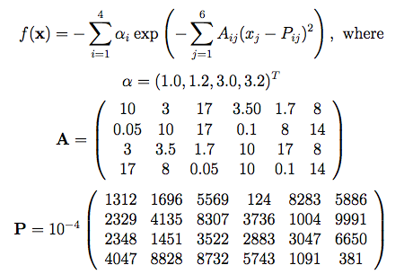

# Hyperparameter Optimization with Ax: Adaptive Experimentation Platform

[Adaptive Experimentation Platform](https://ax.dev/): Ax is an accessible, general-purpose platform for understanding, managing, deploying, and automating adaptive experiments.

> Adaptive experimentation is the machine-learning guided process of iteratively exploring a (possibly infinite) parameter space in order to identify optimal configurations in a resource-efficient manner. Ax currently supports Bayesian optimization and bandit optimization as exploration strategies. Bayesian optimization in Ax is powered by [BoTorch](https://github.com/pytorch/botorch), a modern library for Bayesian optimization research built on PyTorch.

Features:

- Developed by Meta/Facebook.
- MIT license.
- Open Source: [Github](https://github.com/facebook/Ax)
- Modular: Easy to plug in new algorithms and use the library across different domains.
- Supports A/B Tests: Field experiments require a range of considerations beyond standard optimization problems.
- Production-Ready: Support for industry-grade experimentation and optimization management, including MySQL storage.
- **I think Ax is clearly a very advanced and flexible library for hyperparameter optimization; however, it seems more complex/difficult to use than the other typical libraries.**

For installation:

```bash
conda install pytorch torchvision -c pytorch  # OSX only (details below)
pip install ax-platform
# Ax is quite sensitive to the scipy version, I've noticed
# Optimizations fail with errors if lower versions are used
pip install scipy==1.10.1

# Optional
pip install jupyter
pip install SQLAlchemy
```

## Tutorials

The package has a series of tutorials: [Ax Tutorials](https://ax.dev/tutorials/).

I downloaded the following jupyter notebooks of the examples (in order):

- **[`01_gpei_hartmann_loop.ipynb`](01_gpei_hartmann_loop.ipynb): Loop API.**
- **[`02_gpei_hartmann_service.ipynb`](02_gpei_hartmann_service.ipynb): Service API.**
- [`03_gpei_hartmann_developer.ipynb`](03_gpei_hartmann_developer.ipynb): Developer API.
- [`04_visualizations.ipynb`](04_visualizations.ipynb): Visualization tools.
- [`05_generation_strategy.ipynb`](05_generation_strategy.ipynb): `GenerationStrategy`, optimization algorithm specification.
- [`06_scheduler.ipynb`](06_scheduler.ipynb): `Scheduler`.
- [`07_modular_botax.ipynb`](07_modular_botax.ipynb): interface to `BoTorch` module.
- **[`08_tune_cnn.ipynb`](08_tune_cnn.ipynb): (Bayesian) hyperparameter optimization for Pytorch**.

In the following, I comment the examples in bold, which are th emost interesting ones for me.

Note that the package has 3 APIs:

> - Loop API: The loop API is the most lightweight way to do optimization in Ax. The user makes one call to `optimize`, which performs all of the optimization under the hood and returns the optimized parameters.
> - Service API: The Ax Service API is designed to allow the user to control scheduling of trials and data computation while having an easy to use interface with Ax.
> - Developer API: The Developer API is suitable when the user wants maximal customization of the optimization loop.

The first 3 notebooks analyze those APIs with the standard [Hartmann 6](https://www.sfu.ca/~ssurjano/hart6.html) optimization problem. As described in part by ChatGPT

> The Hartmann 6 function is a well-known benchmark function often used in optimization and machine learning. It is a multi-dimensional function with six variables, defined as follows:
> ```
> f(x) = -sum(Ci * exp(-sum(Aij * (xi - Pij)^2)))
> ```
> where `x` is a vector of six variables, `Aij`, `Pij`, and `Ci` are constants specific to the function.
>
> The Hartmann 6 function is a global optimization problem, and the goal is to find the set of variables `x in (0,1)` that minimizes the function `f(x)`. It is a challenging function to optimize due to its complex shape and multiple local optima.
>
> The Hartmann 6 function is often used to evaluate and compare the performance of optimization algorithms, as it provides a difficult and well-defined optimization problem. It helps assess the ability of an optimization algorithm to find the global minimum in a high-dimensional space.
>
> Here are the specific values for the constants:
>
> ```plaintext
> A = [[10, 3, 17, 3.5, 1.7, 8],
>      [0.05, 10, 17, 0.1, 8, 14],
>      [3, 3.5, 1.7, 10, 17, 8],
>      [17, 8, 0.05, 10, 0.1, 14]]
> 
> P = [[0.1312, 0.1696, 0.5569, 0.0124, 0.8283, 0.5886],
>      [0.2329, 0.4135, 0.8307, 0.3736, 0.1004, 0.9991],
>      [0.2348, 0.1451, 0.3522, 0.2883, 0.3047, 0.665],
>      [0.4047, 0.8828, 0.8732, 0.5743, 0.1091, 0.0381]]
> 
> C = [1, 1.2, 3, 3.2]
> ```
> 
> The solution to the optimization problem:
>
> ```
> f(x_min) = -3.32237
> x_min = [0.20169, 0.150011, 0.476874, 0.275332, 0.311652, 0.6573]
> ```



### Loop API

Notebook: [`01_gpei_hartmann_loop.ipynb`](01_gpei_hartmann_loop.ipynb)

Summary of the example/tutorial:

- The Hartmann 6 is optimized.
- We pass to `optimize()` the `objective()` and the hyperparameter space.
- The interface is similar to other libraries.
- We can use several metrics for the optimization and set constraints on them.
- Plots: 
  - contour plots: parameter vs. metric
  - convergence plot

```python
import numpy as np

from ax.plot.contour import plot_contour
from ax.plot.trace import optimization_trace_single_method
from ax.service.managed_loop import optimize
from ax.metrics.branin import branin
from ax.utils.measurement.synthetic_functions import hartmann6
from ax.utils.notebook.plotting import render, init_notebook_plotting

init_notebook_plotting()

# Evaluation/objective function
# Args: parameterization [, weight]
# parametetrization: dictionary with parameter samplings
def hartmann_evaluation_function(parameterization):
    x = np.array([parameterization.get(f"x{i+1}") for i in range(6)])
    # Return: dictionary of metric names to tuples of mean and standard error for those metrics
    # Note that we can use several metrics! (One will be in most cases f(x), the objective)
    # In our case, standard error is 0, since we are computing a synthetic function.
    # In a regular situation, we could run cross_validation.
    # If one metric (f(x)), we return one tuple; if only mean, standard error set as unknown.
    return {"hartmann6": (hartmann6(x), 0.0), "l2norm": (np.sqrt((x ** 2).sum()), 0.0)}

# Optimization function.
# (Hyper-) Parameter space (+ type, bound/range, scale) passed as a list of dictionaries
# Objective function defined above passed here.
# Additional values:
# - number of trials
# - minimize or maximize
# - constrains: for parameters or for metrics; they are defined as equation strings!
# Returned objects:
# - best_parameters: x_min
# - values: metric values at x_min, i.e., f(x_min), etc.; means and covariances
# - expriment, model: objects for later processing
best_parameters, values, experiment, model = optimize(
    parameters=[
        {
            "name": "x1",
            "type": "range",
            "bounds": [0.0, 1.0],
            "value_type": "float",  # Optional, defaults to inference from type of "bounds".
            "log_scale": False,  # Optional, defaults to False.
        },
        {
            "name": "x2",
            "type": "range",
            "bounds": [0.0, 1.0],
        },
        {
            "name": "x3",
            "type": "range",
            "bounds": [0.0, 1.0],
        },
        {
            "name": "x4",
            "type": "range",
            "bounds": [0.0, 1.0],
        },
        {
            "name": "x5",
            "type": "range",
            "bounds": [0.0, 1.0],
        },
        {
            "name": "x6",
            "type": "range",
            "bounds": [0.0, 1.0],
        },
    ],
    experiment_name="test",
    objective_name="hartmann6",
    evaluation_function=hartmann_evaluation_function,
    minimize=True,  # Optional, defaults to False.
    parameter_constraints=["x1 + x2 <= 20"],  # Optional.
    outcome_constraints=["l2norm <= 1.25"],  # Optional.
    total_trials=30, # Optional.
)

# Get solution
best_parameters

means, covariances = values
print(means)
print(covariances)

# Real min
hartmann6.fmin

# Plot: contour plot
# 2 parameters & 1 metric
render(plot_contour(model=model, param_x='x1', param_y='x2', metric_name='hartmann6'))
render(plot_contour(model=model, param_x='x1', param_y='x2', metric_name='l2norm'))

# Convergence plot
# `plot_single_method` expects a 2-d array of means, because it expects to average means from multiple 
# optimization runs, so we wrap out best objectives array in another array.
best_objectives = np.array([[trial.objective_mean for trial in experiment.trials.values()]])
best_objective_plot = optimization_trace_single_method(
    y=np.minimum.accumulate(best_objectives, axis=1),
    optimum=hartmann6.fmin,
    title="Model performance vs. # of iterations",
    ylabel="Hartmann6",
)
```


### Service API

Notebook: [`02_gpei_hartmann_service.ipynb`](02_gpei_hartmann_service.ipynb).

The Ax Service API is designed to allow the user to control scheduling of trials and data computation while having an easy to use interface with Ax.

The user iteratively:

- Queries Ax for candidates
- Schedules / deploys them however they choose
- Computes data and logs to Ax
- Repeat

In the notebook,

- The Hartmann 6 is optimized.
- We 
  - instantiate ab `AxClient`
  - `create_experiment()` with search space
  - define an objective to `evaluate()`
  - and run the optimization loop manually by calling `get_next_trial()` and `complete_trial()`
    - the search/selection algorithm is automatically chosen:
      - Sobol: random choice of points (random search)
      - GPEI: Gaussian Process with Expected Improvement
- The interface is similar to the Loop API, but the optimization loop is handled manually.
- Also:
  - Best params are retrieved
  - Experiment is saved to JSON
  - Parallelization capabilities are queried
  - Plots are shown: 
    - contour plots: parameter vs. metric
    - convergence plot

Additionally, other topics are dicussed in the comments/text; I have decided not to add them here, because at this stage they either didn't work for me or I have important questions to be solved before using them:

- Parallelization: we get the trials that could be parallelized, but how can we parallelize them?
- Storing as SQL object: some setup needs to be done so that it works, which I didn't do.
- Errors: some errors are discussed and solutions provided; not tested.

```python
import numpy as np

from ax.service.ax_client import AxClient, ObjectiveProperties
from ax.utils.measurement.synthetic_functions import hartmann6
from ax.utils.notebook.plotting import render, init_notebook_plotting

init_notebook_plotting()

# Create a client object to interface with Ax APIs.
# By default this runs locally without storage.
ax_client = AxClient()

# Expriment defined with: search space + optimization configuration
# search space = parameters + constrains
# optimization configuration = objective name + minimization setting + outcome constraints
ax_client.create_experiment(
    name="hartmann_test_experiment",
    parameters=[
        {
            "name": "x1",
            "type": "range",
            "bounds": [0.0, 1.0],
            "value_type": "float",  # Optional, defaults to inference from type of "bounds".
            "log_scale": False,  # Optional, defaults to False.
        },
        {
            "name": "x2",
            "type": "range",
            "bounds": [0.0, 1.0],
        },
        {
            "name": "x3",
            "type": "range",
            "bounds": [0.0, 1.0],
        },
        {
            "name": "x4",
            "type": "range",
            "bounds": [0.0, 1.0],
        },
        {
            "name": "x5",
            "type": "range",
            "bounds": [0.0, 1.0],
        },
        {
            "name": "x6",
            "type": "range",
            "bounds": [0.0, 1.0],
        },
    ],
    objectives={"hartmann6": ObjectiveProperties(minimize=True)},
    parameter_constraints=["x1 + x2 <= 2.0"],  # Optional.
    outcome_constraints=["l2norm <= 1.25"],  # Optional.
)

# Objective/evaluation function: Hartman 6 with 2 metrics
# As in the Loop API, we return a dictionary mapping to tuples of (mean, std. err.)
# Note that all returned metrics correspond to either the objective_name
# set on experiment creation or the metric names mentioned in outcome_constraints
def evaluate(parameters):
    x = np.array([parameters.get(f"x{i+1}") for i in range(6)])
    # In our case, standard error is 0, since we are computing a synthetic function.
    return {"hartmann6": (hartmann6(x), 0.0), "l2norm": (np.sqrt((x ** 2).sum()), 0.0)}

# With the Service API, once we define the experiment, we start and manage the
# optimization loop: we get the trial from the client and pass it bact to it.
# Ax auto-selects the best suited optimization algorithm for the search space.
# If we want to control the type of algorithm, we need to pass generation_strategy
# to the AxClient constructor
for i in range(25):
    # When Bayesian optimization is used, generating new trials may take some minutes
    parameters, trial_index = ax_client.get_next_trial()
    # Local evaluation here can be replaced with deployment to external system.
    ax_client.complete_trial(trial_index=trial_index, raw_data=evaluate(parameters))

# We can get how the experiment can be parallelized
# "the max parallelism is 12 for the first 12 trials and 3 for all subsequent trials"
# - the first 12 trials are prodecued quasi-randomly
# - the next trials are produced with Bayesian optimization
ax_client.get_max_parallelism()

# Get trial values
# We see that the first 12 trails are generated by Sobol = a random generation approach.
# The next trials are generated by GPEI = Gaussian Process with Expected Improvement acquisition function 
ax_client.generation_strategy.trials_as_df
#   Generation Step	Generation Model	Trial Index	Trial Status	Arm Parameterizations
# 0	0	            Sobol               0	        COMPLETED	    {'0_0': {'x1': 0.42, 'x2': 0.68, 'x3': 0.22, '...
# ...

# Get best params
best_parameters, values = ax_client.get_best_parameters()
best_parameters

# Get objective/metric values
means, covariances = values
means
# {'hartmann6': -2.187800548657189, 'l2norm': 1.2377562965500042}

# Groud truth for Hartmann 6 min
hartmann6.fmin
# -3.32237

# Contour Plot: 2 params vs metric
render(ax_client.get_contour_plot())

render(ax_client.get_contour_plot(param_x="x3", param_y="x4", metric_name="l2norm"))

# Convergence plot
render(ax_client.get_optimization_trace(objective_optimum=hartmann6.fmin))  # Objective_optimum is optional.

# We can serialize the experiment to JSON
ax_client.save_to_json_file(filepath='ax_client_snapshot.json')

# Load JSON
restored_ax_client = AxClient.load_from_json_file(filepath='ax_client_snapshot.json')
```

### Developer API

Notebook: [`03_gpei_hartmann_developer.ipynb`](03_gpei_hartmann_developer.ipynb)

The Developer API is suitable when the user wants maximal customization of the optimization loop. This tutorial demonstrates optimization of a Hartmann6 function using the `Experiment` construct. In this example, trials will be evaluated synchronously.

The API is more complex and manual, compared to the other two. Ax is clearly much more powerful than any other hyperparameter optimizer I have tried.

I won't paste the code here.

<!--
### Visualization Tools

Notebook: [`04_visualizations.ipynb`](04_visualizations.ipynb).

:construction:

### Generation Strategy

Notebook: [`05_generation_strategy.ipynb`](05_generation_strategy.ipynb)

:construction:

### Scheduler

Notebook: [`06_scheduler.ipynb`](06_scheduler.ipynb).

:construction:

### BoTorch Interface

Notebook: [`07_modular_botax.ipynb`](07_modular_botax.ipynb)

:construction:
-->

### Bayesian Hyperparameter Optimization for Pytorch

Notebook: [`08_tune_cnn.ipynb`](08_tune_cnn.ipynb).

This is a nice example in which a very simple CNN (pre-implemented using Pytorch within Ax) is used to find the optimum hyperparameters.

The Loop API is used.

```python
import torch
import numpy as np
import inspect

from ax.plot.contour import plot_contour
from ax.plot.trace import optimization_trace_single_method
from ax.service.managed_loop import optimize
from ax.utils.notebook.plotting import render, init_notebook_plotting
from ax.utils.tutorials.cnn_utils import load_mnist, train, evaluate, CNN

init_notebook_plotting()

# Set torch vairables
torch.manual_seed(12345)
dtype = torch.float
device = torch.device("cuda" if torch.cuda.is_available() else "cpu")

# Download dataset
# Even though these utility functions are from Ax, they really are torch objects
BATCH_SIZE = 512
train_loader, valid_loader, test_loader = load_mnist(batch_size=BATCH_SIZE)

# Objetive function:
# - instantiate CNN
# - train CNN
# - evaluate CNN with validation split
# The function takes in a parameterization (set of parameter values),
# computes the classification accuracy,
# and returns a dictionary of metric name ('accuracy')
# to a tuple with the mean and standard error.
def train_evaluate(parameterization):
    net = CNN()
    net = train(net=net, train_loader=train_loader, parameters=parameterization, dtype=dtype, device=device)
    return evaluate(
        net=net,
        data_loader=valid_loader,
        dtype=dtype,
        device=device,
    )

# Ax has a custom Pytorch CNN definition for testing purposes
net = CNN()
net
# CNN(
#   (conv1): Conv2d(1, 20, kernel_size=(5, 5), stride=(1, 1))
#   (fc1): Linear(in_features=1280, out_features=64, bias=True)
#   (fc2): Linear(in_features=64, out_features=10, bias=True)
# )

# Get the implementation of train()
source_code = inspect.getsource(train)
print(source_code)
'''
def train(
    net: torch.nn.Module,
    train_loader: DataLoader,
    parameters: Dict[str, float],
    dtype: torch.dtype,
    device: torch.device,
) -> nn.Module:
    """
    Train CNN on provided data set.

    Args:
        net: initialized neural network
        train_loader: DataLoader containing training set
        parameters: dictionary containing parameters to be passed to the optimizer.
            - lr: default (0.001)
            - momentum: default (0.0)
            - weight_decay: default (0.0)
            - num_epochs: default (1)
        dtype: torch dtype
        device: torch device
    Returns:
        nn.Module: trained CNN.
    """
    # Initialize network
    net.to(dtype=dtype, device=device)
    net.train()
    # Define loss and optimizer
    criterion = nn.NLLLoss(reduction="sum")
    optimizer = optim.SGD(
        net.parameters(),
        lr=parameters.get("lr", 0.001),
        momentum=parameters.get("momentum", 0.0),
        weight_decay=parameters.get("weight_decay", 0.0),
    )
    scheduler = optim.lr_scheduler.StepLR(
        optimizer,
        step_size=int(parameters.get("step_size", 30)),
        gamma=parameters.get("gamma", 1.0),  # default is no learning rate decay
    )
    num_epochs = parameters.get("num_epochs", 1)

    # Train Network
    # pyre-fixme[6]: Expected `int` for 1st param but got `float`.
    for _ in range(num_epochs):
        for inputs, labels in train_loader:
            # move data to proper dtype and device
            inputs = inputs.to(dtype=dtype, device=device)
            labels = labels.to(device=device)

            # zero the parameter gradients
            optimizer.zero_grad()

            # forward + backward + optimize
            outputs = net(inputs)
            loss = criterion(outputs, labels)
            loss.backward()
            optimizer.step()
            scheduler.step()
    return net

'''

# Get the implementation of evaluate()
source_code = inspect.getsource(evaluate)
print(source_code)
'''
def evaluate(
    net: nn.Module, data_loader: DataLoader, dtype: torch.dtype, device: torch.device
) -> float:
    """
    Compute classification accuracy on provided dataset.

    Args:
        net: trained model
        data_loader: DataLoader containing the evaluation set
        dtype: torch dtype
        device: torch device
    Returns:
        float: classification accuracy
    """
    net.eval()
    correct = 0
    total = 0
    with torch.no_grad():
        for inputs, labels in data_loader:
            # move data to proper dtype and device
            inputs = inputs.to(dtype=dtype, device=device)
            labels = labels.to(device=device)
            outputs = net(inputs)
            _, predicted = torch.max(outputs.data, 1)
            total += labels.size(0)
            correct += (predicted == labels).sum().item()

    return correct / total

'''

# Optimization with Loop API
# objective passed to evaluation_function, along with parameter space
best_parameters, values, experiment, model = optimize(
    parameters=[
        {"name": "lr", "type": "range", "bounds": [1e-6, 0.4], "log_scale": True},
        {"name": "momentum", "type": "range", "bounds": [0.0, 1.0]},
    ],
    evaluation_function=train_evaluate,
    objective_name='accuracy',
)

# Print best parameters
best_parameters

# Print best metrics
means, covariances = values
means, covariances

# Plot: contours; parameters vs. metrics
render(plot_contour(model=model, param_x='lr', param_y='momentum', metric_name='accuracy'))

# Plot: convergence
# `plot_single_method` expects a 2-d array of means, because it expects to average means from multiple 
# optimization runs, so we wrap out best objectives array in another array.
best_objectives = np.array([[trial.objective_mean*100 for trial in experiment.trials.values()]])
best_objective_plot = optimization_trace_single_method(
    y=np.maximum.accumulate(best_objectives, axis=1),
    title="Model performance vs. # of iterations",
    ylabel="Classification Accuracy, %",
)
render(best_objective_plot)

# Get best training data
data = experiment.fetch_data()
df = data.df
best_arm_name = df.arm_name[df['mean'] == df['mean'].max()].values[0]
best_arm = experiment.arms_by_name[best_arm_name]
best_arm
# Arm(name='15_0', parameters={'lr': 7.706601907492064e-05, 'momentum': 0.7845666373189663})

# Combine training and validation datasets
combined_train_valid_set = torch.utils.data.ConcatDataset([
    train_loader.dataset.dataset, 
    valid_loader.dataset.dataset,
])
combined_train_valid_loader = torch.utils.data.DataLoader(
    combined_train_valid_set, 
    batch_size=BATCH_SIZE, 
    shuffle=True,
)

# Train and evaluate with best parameters
net = train(
    net=CNN(),
    train_loader=combined_train_valid_loader, 
    parameters=best_arm.parameters,
    dtype=dtype,
    device=device,
)
test_accuracy = evaluate(
    net=net,
    data_loader=test_loader,
    dtype=dtype,
    device=device,
)

print(f"Classification Accuracy (test set): {round(test_accuracy*100, 2)}%")
# Classification Accuracy (test set): 96.66%

```